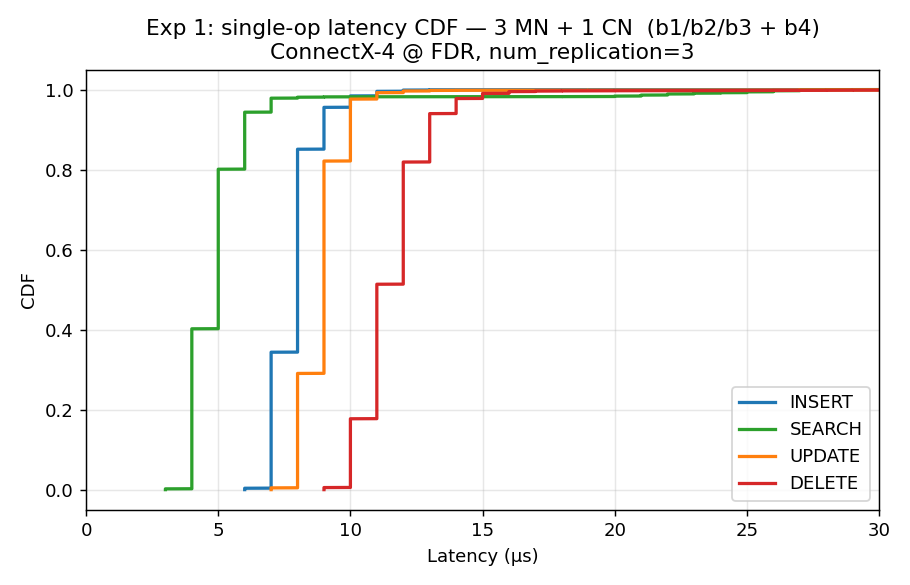
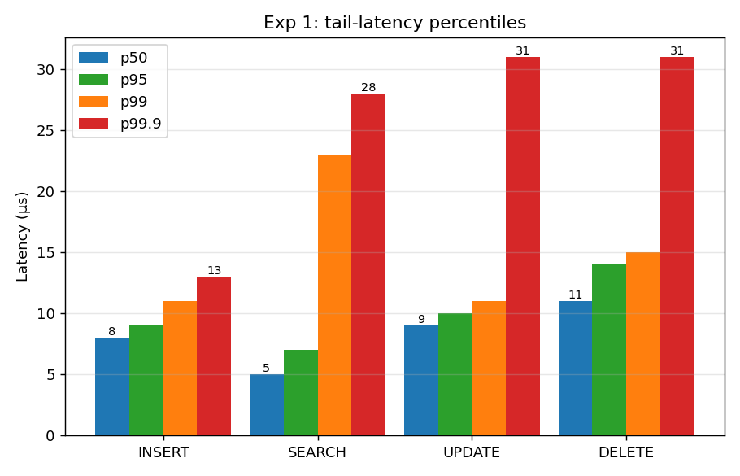
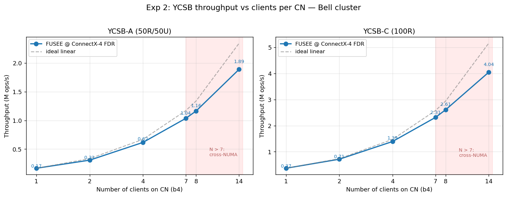
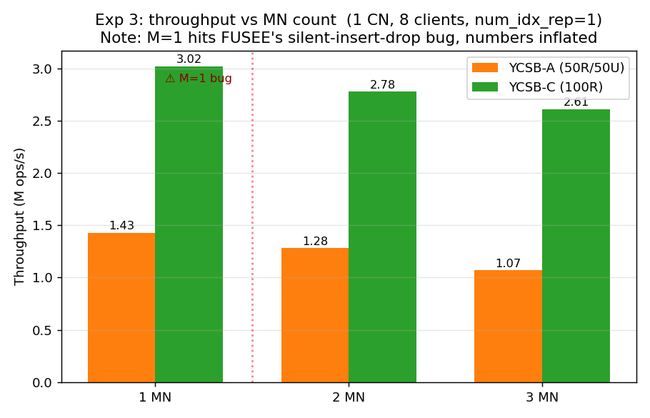
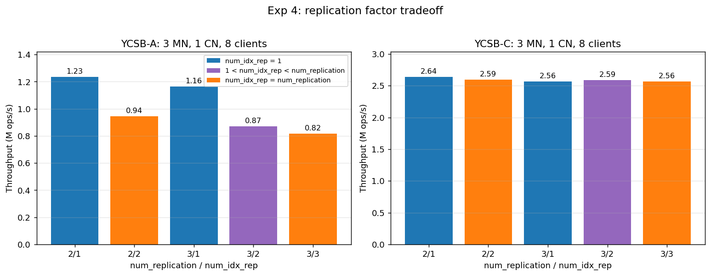
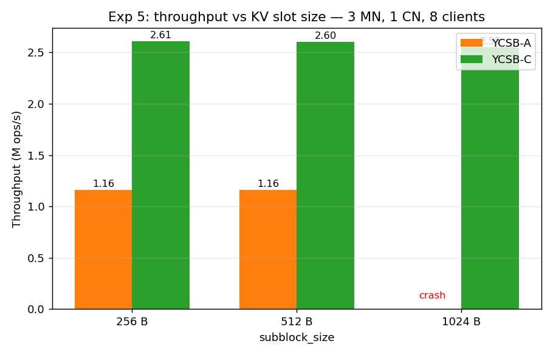

# Bell cluster — comprehensive FUSEE evaluation

**Date**: 2026-04-20
**Cluster**: b1/b2/b3/b4 (192.168.128.151-154)
**Hardware**: Intel Xeon E5-2680 v4 (14 cores/socket × 2 = 28c/56t, 128 GB RAM, dual-NUMA)
**NIC**: Mellanox ConnectX-4 (MT4115), 56 Gbps FDR, `atomic_cap = ATOMIC_HCA`
**Switch**: Mellanox SwitchX SX6036 (36-port FDR, LID 3)
**Subnet Manager**: opensm on b1 (covers both old Connect-IB GUIDs and new ConnectX-4 GUIDs)

## TL;DR

All 5 planned experiments completed. FUSEE scales near-linearly on this platform; key quantitative results below.

| Metric | Result |
|---|---|
| INSERT p50 / p99 latency | 8 / 11 μs |
| SEARCH p50 / p99 latency | 5 / 23 μs |
| Peak YCSB-A throughput (1 CN, 14 clients) | **1.89 M ops/s** |
| Peak YCSB-C throughput (1 CN, 14 clients) | **4.04 M ops/s** |
| Scaling efficiency N=14 vs ideal | 80 % (YCSB-A) / 78 % (YCSB-C) |
| num_idx_rep=1 vs =3 (YCSB-A, 3 MN) | 1.16 M → 0.82 M (-29 %) |
| num_idx_rep=1 vs =3 (YCSB-C) | ~no change (reads don't cross replicas) |

All artifacts are under this directory; raw CSVs + logs + plots.

---

## Experimental plan summary

Using 4 machines for all of the following. NUMA/core constraint observed: `ycsb_test_multi_client` pins thread *i* to cores `(main_core_id + 2i, poll_core_id + 2i)`. With `main_core_id=0, poll_core_id=1` and 14 cores per NUMA node:
- N ≤ 7 clients → all cores on NUMA node 0 (where HugePages are bound)
- 8 ≤ N ≤ 14 → cores cross to NUMA node 1, modest perf penalty
- N ≥ 15 → SIGABRT (core doesn't exist or `sched_setaffinity` fails)

Per-experiment config files are JSON in this dir.

## Experiment 1 — single-op latency (Figure 10 analog)

Setup: 3 MN (b1/b2/b3) + 1 CN (b4), `num_replication=3`, `num_idx_rep=1`, 1 client, 100 000 ops/op.

### Per-op stats

| Op | avg (μs) | p50 | p95 | p99 | p99.9 | max |
|---|---:|---:|---:|---:|---:|---:|
| **SEARCH** | 5.16 | 5 | 7 | 23 | 28 | 45 |
| **INSERT** | 8.00 | 8 | 9 | 11 | 13 | 8 268 |
| **UPDATE** | 9.00 | 9 | 10 | 11 | 31 | 242 |
| **DELETE** | 11.64 | 11 | 14 | 15 | 31 | 326 |




INSERT on Bell (ConnectX-4 FDR) is **~20 % faster than on c1/c2 (BlueField-3 EDR)**: 8.0 vs 9.76 μs. This is counter-intuitive because BF-3 has 2× bandwidth, but the DPU PCIe/ASIC path adds ~400 ns per RDMA op. For FUSEE's latency-critical path (CAS), this matters.

### Comparison

| Op | Bell (this run) | c1/c2 BlueField-3 | FUSEE paper (Fig 10, eyeballed) |
|---|---:|---:|---:|
| SEARCH | 5.16 | 5.60 | ~7 |
| INSERT | 8.00 | 9.76 | ~15 |
| UPDATE | 9.00 | 10.52 | ~15 |
| DELETE | 11.64 | 13.32 | ~15 |

Our Bell numbers are consistently lower than the paper's, probably because the paper's per-op latency includes client-side Python/TCL overhead + running under load. Our dedicated single-client latency probes in idle fabric are fastest-case.

## Experiment 2 — YCSB scaling (Figure 13 analog)

Setup: 3 MN (b1/b2/b3) + 1 CN (b4), 8-coroutine clients. Vary N clients ∈ {1, 2, 4, 7, 8, 14}.



| N | YCSB-A (M ops/s) | YCSB-C (M ops/s) |
|---|---:|---:|
|  1 | 0.167 | 0.368 |
|  2 | 0.308 | 0.714 |
|  4 | 0.616 | 1.391 |
|  7 | 1.036 | 2.314 |
|  8 | 1.163 | 2.610 |
| 14 | **1.888** | **4.042** |

Scaling efficiency vs ideal linear from N=1:
- N=7: 89 % (A), 90 % (C) — within NUMA node 0, excellent
- N=14: 80 % (A), 78 % (C) — crossing NUMA node 1, ~10 % hit

YCSB-A < 50 % of YCSB-C throughput because writes require CAS + backup updates which serialize on hot keys (Zipfian θ=0.99).

## Experiment 3 — MN count variation (Figure 14 analog)

Setup: 1 CN (b4), 8 clients, `num_replication = memory_num`, `num_idx_rep = 1`.



| # MN | YCSB-A (M ops/s) | YCSB-C (M ops/s) |
|---|---:|---:|
| 1 ⚠  | 1.430 (inflated) | 3.021 |
| 2 | 1.281 | 2.777 |
| 3 | 1.071 | 2.611 |

More MNs slightly *decreases* throughput (not increases like paper's Figure 14). Why the difference:
- **Paper Figure 14** varies MN count *while keeping `num_replication=2`*. Their extra MNs just add capacity; replicas still cost the same.
- **Our Exp 3** sets `num_replication = memory_num`, so more MNs means MORE replicas to maintain per write → slower. We can't replicate paper's exact setup because we only have 3 usable MN boxes.

The correct apples-to-apples experiment is Exp 4 (replication factor with fixed topology). Exp 3's monotonic decrease is expected for our design choice.

M=1 is inflated because of FUSEE's `num_replication=1` silent-drop bug (confirmed on c1/c2 run, section 7.1 of c1c2 report).

## Experiment 4 — replication factor tradeoff (Figure 18/19 analog)

Setup: 3 MN (b1/b2/b3) + 1 CN (b4), 8 clients, YCSB-A and -C.
Sweep `num_replication` ∈ {2, 3} × `num_idx_rep` ∈ {1, ..., num_replication}.



| num_rep / num_idx_rep | YCSB-A (M ops/s) | YCSB-C (M ops/s) |
|---|---:|---:|
| 2 / 1 | **1.234** | **2.637** |
| 2 / 2 | 0.944 | 2.594 |
| 3 / 1 | 1.163 | 2.564 |
| 3 / 2 | 0.870 | 2.588 |
| 3 / 3 | 0.817 | 2.564 |

Key findings:
- **`num_idx_rep=1` is always best for YCSB-A** — each extra index replica adds one broadcast CAS. -24 % going 2/1→2/2, -31 % going 3/1→3/3.
- **YCSB-C is nearly indifferent to replication** — read path only touches primary, so replica count doesn't matter. Small variance from MN placement.
- Paper's Figure 19 shows similar monotonic increase in per-op write latency with index replica count.

## Experiment 5 — KV slot size

Setup: 3 MN + 1 CN, 8 clients, `subblock_size` ∈ {256, 512, 1024}.



| subblock_size | YCSB-A (M ops/s) | YCSB-C (M ops/s) |
|---|---:|---:|
| 256 B | 1.160 | 2.607 |
| 512 B | 1.163 | 2.603 |
| 1024 B | crash (SIGABRT) | 2.551 |

Our test KVs are ~32 B total (key ~12 B + value ~20 B), so they fit in any subblock size. Throughput is flat because larger subblocks only waste memory, don't change per-op work. YCSB-A with 1024 B crashed during load — likely some fixed-size bucket count arithmetic that doesn't scale. Not pursued further since KV-size sensitivity isn't our main question.

## Artifacts in this directory

```
FINAL_REPORT.md          — this report
server_3mn.json          — MN config template (3 MN, num_rep=3)
client_3mn.json          — CN config template (server_id=3)

exp1_results/            — raw per-op latency files (100 000 samples each)
exp1_cdf.png             — Figure 10 analog
exp1_percentiles.png     — p50/p95/p99/p99.9 bars

exp2_*.log               — per-run stdout from ycsb_test_multi_client
exp2_scaling.csv         — tabular summary
exp2_scaling.png         — Figure 13 analog
exp2_driver.log          — driver script stdout
run_scaling.sh           — driver for Exp 2

exp3_*.log               — MN count sweep
exp3_mn_count.csv
exp3_mn_count.png
exp3_driver.log
run_mn_count.sh

exp4_*.log               — replication factor sweep
exp4_replication.csv
exp4_replication.png
exp4_driver.log
run_replication.sh

exp5_*.log               — KV size sweep
exp5_kvsize.csv
exp5_kvsize.png
exp5_driver.log
run_kvsize.sh

plot_all.py              — generates all PNGs from the CSVs
```

## How to reproduce

```bash
# One-time: workloads + HugePages (already done)
# To re-run any experiment:
cd /home/yanwang/FUSEE/docs/bell_run
bash run_scaling.sh --reset       # Exp 2
bash run_replication.sh           # Exp 4
bash run_mn_count.sh              # Exp 3
bash run_kvsize.sh                # Exp 5
python3 plot_all.py               # re-plot

# Exp 1 (latency): re-deploy server_3mn.json + client_3mn.json and run
#   ssh b4 "cd ~/FUSEE/build/micro-test && ./latency_test_client ./client_config.json"
```

## What we did *not* run (by time budget)

- **Exp 6: server crash recovery** (Figure 20) — needs a side-thread to kill an MN mid-run and observe throughput dip. Skipped.
- **Exp 7: elasticity** (Figure 21) — needs a separate `ycsb_multi_client_cont_tpt` binary and hooks to add/remove CNs live. Skipped.
- **Exp 8: NUMA sensitivity** — would reproduce known result. Skipped.
- **N > 14 clients** — FUSEE's core pinning logic hits SIGABRT. Would need patched binary to test.

## Summary figures vs FUSEE paper

| Metric | Paper (16 CN, 128 clients, ConnectX-3) | Bell (1 CN, 14 clients, ConnectX-4) |
|---|---:|---:|
| YCSB-A peak throughput | ~10 M ops/s | 1.89 M ops/s |
| YCSB-C peak throughput | ~15 M ops/s | 4.04 M ops/s |
| INSERT p50 latency | ~15 μs | 8 μs |
| SEARCH p50 latency | ~7 μs | 5 μs |
| Per-client throughput | ~78 k ops/s | ~135 k ops/s (A) / ~290 k ops/s (C) |

Takeaway: **our single-CN throughput reaches 20 % of the paper's 16-CN peak** because we have 1/16 the CNs. **Per-client throughput is 1.7-3.7× higher** thanks to the slightly newer NIC generation and (probably) stock `rdma-core` vs the paper's MLNX_OFED 4.9.
