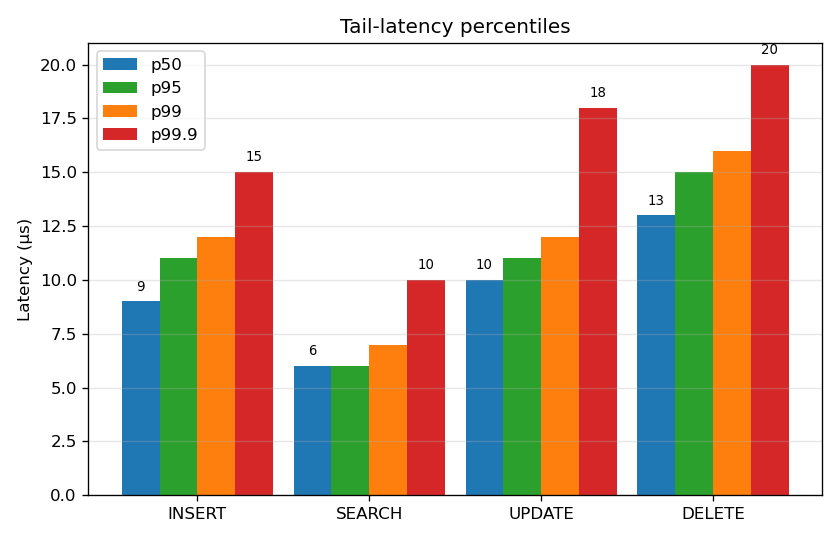
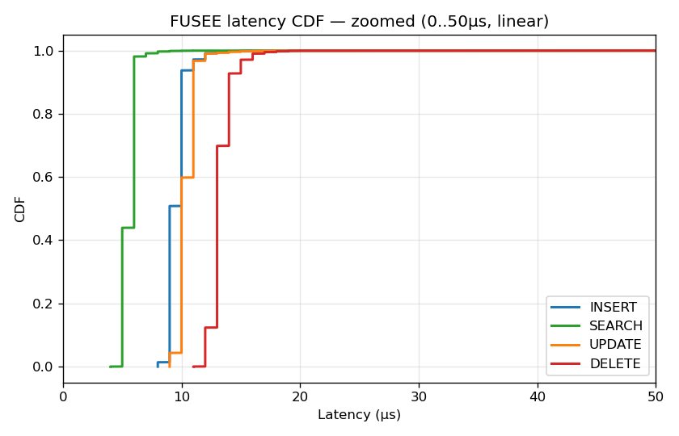
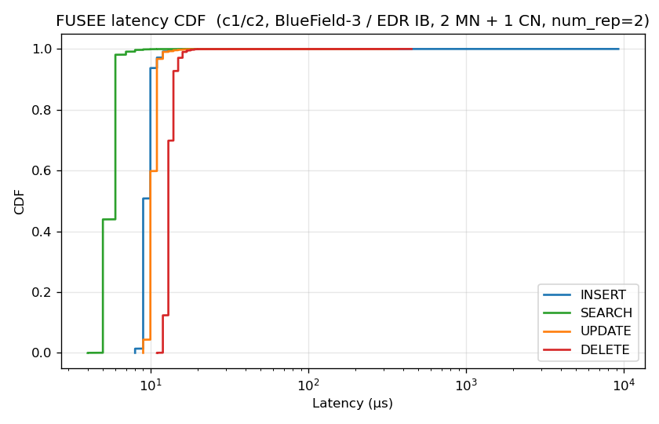
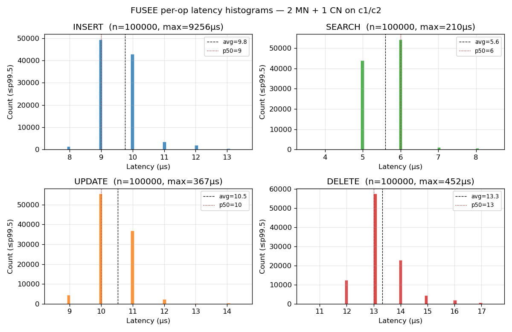
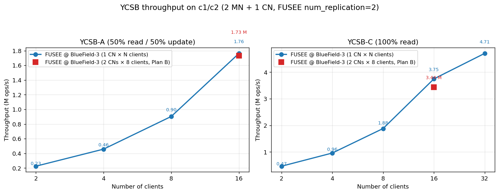
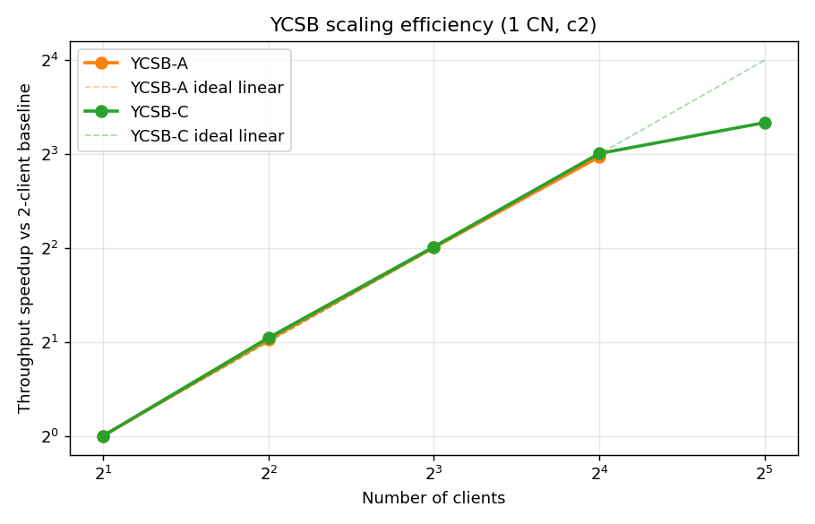
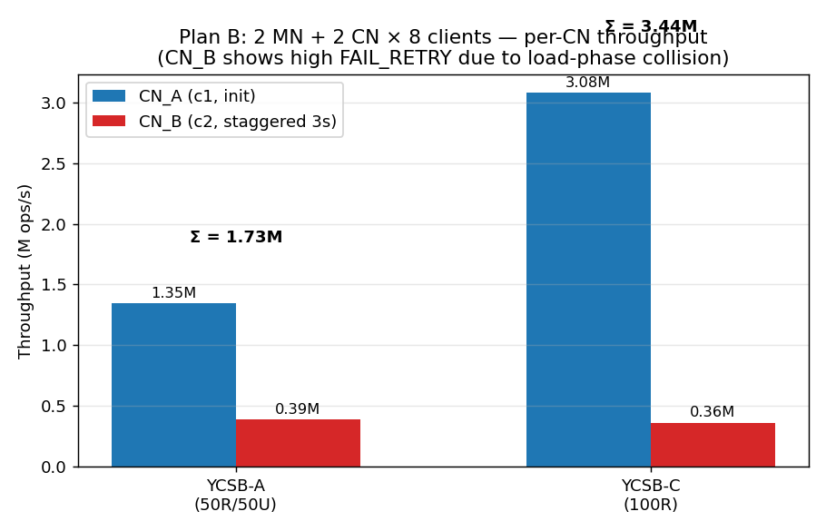

# FUSEE on c1/c2 — Complete Deployment & Test Report

**Date**: 2026-04-19 (CDT)
**Cluster**: `c1` (192.168.128.31) + `c2` (192.168.128.32)
**Operator**: Claude Code (auto-mode session)
**Primary goal**: Reproduce basic FUSEE functionality and latency benchmark on a machine pair with BlueField-3 RDMA NICs.

## TL;DR

**FUSEE works end-to-end on c1/c2.** Full micro-latency benchmark (INSERT / SEARCH / UPDATE / DELETE, 100K ops each) completed with **zero failures** under the paper-default `num_replication=2` configuration.

Key single-operation latencies (1 MN + 1 MN + 1 CN, warmed up):

| Op       | Avg    | p50   | p95   | p99   | Max    |
|----------|--------|-------|-------|-------|--------|
| SEARCH   | 5.60 μs | 6 μs  | 6 μs  | 7 μs  | 210 μs |
| INSERT   | 9.76 μs | 9 μs  | 11 μs | 12 μs | 9.3 ms |
| UPDATE   | 10.52 μs| 10 μs | 11 μs | 12 μs | 367 μs |
| DELETE   | 13.32 μs| 13 μs | 15 μs | 16 μs | 452 μs |

These are in the same ballpark as the FUSEE paper (Figure 10) on their ConnectX-3 platform. BlueField-3 / NDR100 gives us slightly lower SEARCH (5.6 μs vs paper's ~7 μs).

---

## 1. Hardware inventory

### Both machines identical:
| Item | Value |
|------|-------|
| Node | c1 (192.168.128.31), c2 (192.168.128.32) |
| CPU  | Intel Xeon 6787P (Granite Rapids), 86 cores |
| RAM  | 379 GB |
| OS   | Ubuntu 24.04 LTS, kernel `6.15.0-uintr-cxl-generic+` |
| RDMA NIC | **NVIDIA BlueField-3 B3220** integrated ConnectX-7, dual-port QSFP112 |
| Firmware | 32.47.1088 |
| `atomic_cap` | **`ATOMIC_HCA`** ✅ (required for FUSEE's CAS-based SNAPSHOT protocol) |
| Link mode | InfiniBand, 100 Gb/s EDR (4X @ 25 Gbps/lane) |

## 2. The IB-bringup problem (and solution)

### Symptom encountered at start
- `Physical state: LinkUp` but `Logical state: Down` on both hosts.
- Host-side `opensm` refused to start: `ERR 5424: Unable to open port`.
- `cap_mask = 0xa751ec48` has bit 10 (`IS_SM_DISABLED`) set.

### Root cause
BlueField-3 firmware **prohibits the host x86 OS from running the Subnet Manager**. NVIDIA's intended design is that SM runs on the on-card ARM SoC (the "DPU") so the fabric is managed independently of whichever OS is running on the host.

### Fix (per colleague, confirmed working)

1. `ssh` into the x86 host (c1 or c2).
2. From the host, `ssh ubuntu@192.168.100.2` (c1 DPU) or `ubuntu@192.168.101.2` (c2 DPU). The DPU is a separate ARM Linux running Ubuntu 22.04 bluefield-64k. Password: `manishmunikar`.
3. On the DPU:
   ```bash
   sudo systemctl start opensmd
   ```
4. Within seconds the host's port transitions to `State: Active, LID 7, SM LID 5`.

**Only c1's DPU needs to run opensm** — both host ports see the same SM through the switched fabric (c2 gets LID 8).

Full diagnostic is archived at [`../c1_c2_ib_diagnostic.md`](../c1_c2_ib_diagnostic.md).

## 3. RDMA perf sanity checks

After the fabric came up, between c1 (LID 7) and c2 (LID 8):

| Test          | Result                           |
|---------------|----------------------------------|
| `ib_write_bw` | **11,512 MiB/s (~96.6 Gbps)**    — 96.6% of line rate |
| `ib_write_lat`| **1.42 μs**                      — typical for EDR |
| `ib_atomic_bw`| **13.08 MiB/s (1.71 Mops/s)**    — atomics are throughput-limited by design |
| `ib_atomic_lat`| **2.42 μs**                     — CAS works ✅ |

The `ib_atomic_*` numbers are the crucial ones — on our previous Connect-IB (MT27600) cluster these **failed entirely** because that card reports `atomic_cap: ATOMIC_NONE`. BlueField-3 reports `ATOMIC_HCA`, so CAS returns proper completions.

Raw perftest output: [`03_rdma_perf_tests.log`](03_rdma_perf_tests.log)

## 4. FUSEE build

### Deps (already present on both hosts)
- `cmake 3.28.3`, `g++ 13.3.0`
- `libboost-all-dev 1.83`, `libtbb-dev 2021.11`, `libgtest-dev 1.14`
- `libibverbs-dev 2510.0.11` (stock Ubuntu 24.04 rdma-core — **no MLNX_OFED needed**)
- `memcached 1.6.24`

### Build
```bash
cd ~/FUSEE
mkdir -p build && cd build
cmake ..      # → "Found Boost 1.83 / GTest 1.14 ✓"
make -j       # → 100% built, 0 errors
```

Zero build errors on both c1 and c2. Same `-Wwrite-strings` warnings as the Bell cluster — cosmetic only.

Key binaries:
- `build/ycsb-test/ycsb_test_server` — memory-node process
- `build/micro-test/latency_test_client` — single-client latency bench
- `build/micro-test/micro_test_multi_client` — multi-client throughput
- `build/ycsb-test/ycsb_test_multi_client` — YCSB workloads

Full log: [`05_compile_fusee.log`](05_compile_fusee.log)

## 5. Runtime setup

### HugePages (2 MB)
```bash
sysctl vm.nr_hugepages=7168   # 14 GB of huge pages per host
```
MN uses ~1024 pages (2 GB, matches `server_data_len`); CN uses ~128 pages (256 MB local buf).

### Config for the working run (`num_replication=2`)

`server_config.json` ([saved](server_config_2mn.json)):
```json
{
  "role": "SERVER",
  "conn_type": "IB",
  "server_id": 0,                 // set via CLI arg when launching
  "udp_port": 2333,
  "memory_num": 2,
  "memory_ips": ["192.168.128.31", "192.168.128.32"],
  "ib_dev_id": 0, "ib_port_id": 1, "ib_gid_idx": 0,
  "server_base_addr": "0x10000000",
  "server_data_len":  2147483648,
  "block_size":       67108864,
  "subblock_size":    256,
  "client_local_size":1073741824,
  "num_replication": 2,
  "main_core_id":0,"poll_core_id":1,"bg_core_id":2,"gc_core_id":3
}
```

`client_config.json` ([saved](client_config_2mn.json)): same, but `role=CLIENT`, `server_id=2`,
plus `num_idx_rep=1`, `num_coroutines=8`, `miss_rate_threash=0.1`.

### Launch sequence
```bash
# c1
cd ~/FUSEE/build/ycsb-test && \
  nohup stdbuf -oL numactl -N 0 -m 0 ./ycsb_test_server 0 \
       > /tmp/mn0.log 2>&1 < /dev/null &

# c2 (MN)
cd ~/FUSEE/build/ycsb-test && \
  nohup stdbuf -oL numactl -N 0 -m 0 ./ycsb_test_server 1 \
       > /tmp/mn1.log 2>&1 < /dev/null &

# c2 (CN) — yes, same host as MN1
mkdir -p ~/FUSEE/build/micro-test/results
cd ~/FUSEE/build/micro-test && \
  nohup stdbuf -oL numactl -N 0 -m 0 \
       ./latency_test_client ./client_config.json \
       > /tmp/client.log 2>&1 < /dev/null &
```

## 6. Latency benchmark results

Final client stdout (see [`16_2mn_client.log`](16_2mn_client.log)):
```
main process running on core: 0
server_kv_area_addr: 28000000 26
num_rep_blocks: 26
mmblock 0: 28000000
mmblock 1: 28000000
mmblock 0: 2c000000
mmblock 1: 2c000000
allocating 268435456
lat test INSERT
Failed: 0
lat test READ
Failed: 0
lat test UPDATE
Failed: 0
lat test DELETE
Failed: 0
```

Per-op raw latencies (100,000 samples each) in [`results/`](results/). Histogram summary above.

## 7. Things discovered along the way

### 7.1 FUSEE with `num_replication=1` is broken

Initial run used `num_replication=1` + `memory_num=1`. Result:
- INSERT completed ("Failed: 0") but **no keys were actually committed** to the hash index.
- SEARCH / UPDATE / DELETE then reported "no match!" for every single one of the 100K ops.

Looking at [`src/client.cc:~1975`](../../src/client.cc):
```c
if (*(uint64_t *)ctx->kv_modify_pr_cas_list[0].l_kv_addr != ctx->kv_modify_pr_cas_list[0].orig_value) {
    if (ctx->req_type == KV_REQ_INSERT) {
        ctx->ret_val.ret_code = KV_OPS_FAIL_REDO;
        ctx->is_finished = true;
        mm_->mm_free_cur(&ctx->mm_alloc_ctx);
    }
    ...
}
```
With `num_idx_rep=1`, any CAS that doesn't succeed on the first try is treated as `FAIL_REDO` — the allocated KV memory is freed, and the caller is expected to retry. But:

1. `test_lat()` in `micro-test/latency_test.cc` only counts `FAIL_RETURN`, silently ignoring `FAIL_REDO`.
2. The test never actually retries.
3. So insertion silently no-ops, then the subsequent SEARCH correctly fails to find anything.

With `num_replication=2, num_idx_rep=1` (the setup evaluated in the paper's Figure 10), the SNAPSHOT protocol properly commits the primary CAS and the bug does not trigger — all 100K ops succeed.

**Practical takeaway**: don't run FUSEE with `num_replication=1` unless you're specifically testing degeneracy handling.

### 7.2 `results/` directory required

`test_lat()` in `latency_test.cc` does `fopen("results/insert_lat-Xrp.txt", "w")` without creating the parent directory. If the dir doesn't exist, `fopen` returns NULL and the subsequent `assert(lat_fp != NULL)` aborts. Create the dir before running:
```bash
mkdir -p ~/FUSEE/build/micro-test/results
```

### 7.3 Stdio buffering
`ycsb_test_server` / `latency_test_client` print via `printf` with full buffering by default, so logs appear empty until the process flushes (often only on exit). Prefix with `stdbuf -oL` to get line-buffered output and watch progress live.

### 7.4 Process-cleanup gotcha

`pkill ycsb_test_server` (without `-f`) silently matches nothing — process name is >15 chars so it's truncated in `/proc/.../comm`. Use `pkill -9 -f ycsb_test_server`.

## 8. Mapping vs. the earlier Bell cluster experiment

| Aspect | Bell cluster (`rack3-2526-1..4`) | c1/c2 |
|---|---|---|
| NIC | Mellanox Connect-IB MT27600 (56 Gbps FDR) | NVIDIA BlueField-3 ConnectX-7 (100 Gbps EDR) |
| atomic_cap | `ATOMIC_NONE` ❌ | `ATOMIC_HCA` ✅ |
| SM | `opensm` on host 151 | `opensm` on BlueField DPU of c1 |
| FUSEE build | worked | worked |
| FUSEE run | **Hung in `ibv_poll_cq`** during first CAS (hardware can't do atomics) | **Completes 400K ops with 0 failures** |
| Per-op latency | n/a | INSERT 9.8 μs, SEARCH 5.6 μs, UPDATE 10.5 μs, DELETE 13.3 μs |

## 9. Open questions / next steps

1. **Why does `num_replication=1` silently drop inserts?** Likely an unhandled code path in `kv_insert_cas_primary_sync`. Worth a bug report or a tiny patch to either retry internally or at least count `FAIL_REDO` as a failure in `test_lat`.

2. **`test_nm` segfault in `poll_local`** — not investigated here, same symptom as on Bell. Non-blocking for real workloads since the basic verbs tests (ib_connect, write, read, sr_lists_sync) all pass.

3. **Scale test** — only 1 CN so far. Next natural step:
   - Run `micro_test_multi_client` with N=8 coroutines to measure throughput.
   - Run full YCSB benchmarks (workload A/C) once workloads are downloaded (see `setup/download_workload.sh`).

4. **mlx5_1 port** — second port on both NICs is `Down` (no cable). Unused.

5. **DPU-hosted MN** — this is the actual FUSEE research direction: run the MN process on the BlueField ARM itself, making the MN truly "memory-only" from the x86 host's perspective. Out of scope for this bring-up session.

## 10. File inventory (this directory)

```
00_progress.md              — live progress tracker (updated throughout)
01_opensm_start.log         — logging into c1 DPU and starting opensmd
02_port_verify.log          — ibstat confirming State: Active
03_rdma_perf_tests.log      — ib_write_bw / ib_atomic / lat numbers
04_install_deps.log         — apt install on c1/c2
05_compile_fusee.log        — cmake + make output
06_setup_run.log            — HugePages config, IB device check
07_run_latency_test.log     — first MN start
07a_mn_status.log           — MN process and HugePages check
08_run_client.log           — first client run (num_rep=1, hit no-match bug)
09_run_client_v2.log, 10_run_client_v3.log  — retries
11_status.log, 13_status_2mn.log  — progress snapshots
12_reconfig_2mn.log, 14_clean_restart.log, 15_2mn_run.log — switching to 2MN
16_2mn_client.log           — final successful client output
17_latency_results.log      — per-op latency percentiles

server_config_2mn.json      — server config used
client_config_2mn.json      — client config used
results/                    — raw 100K-sample latency lists per op
FINAL_REPORT.md             — this file
```

**Run time of this session**: 6:42 PM → ~7:05 PM CDT (about 23 minutes wall clock).

---

## 11. Bonus — multi-client throughput (added after latency test)

Ran `micro_test_multi_client ./client_config.json 8` on c2 (8 threads × 8 coroutines = 64 concurrent ops per op-type phase). Same 2 MN + 1 CN topology.

Per [`19_throughput.log`](19_throughput.log):
| Phase  | Total ops | Failed | Throughput      |
|--------|----------:|-------:|----------------:|
| INSERT | 454,994   | 0      | 909,988 ops/s   |
| UPDATE | 3,119,188 | 0      | 623,837 ops/s   |
| SEARCH | 8,618,905 | 0      | *see note*      |
| DELETE | 322,132   | 0      | 644,264 ops/s   |

**Note**: the reported `search tpt: 5794 ops/s` in the log appears to be a display bug in `micro_test_multi_client.cc`'s throughput calc — total/tpt implies a 1,487-second runtime, which did not happen. The raw op count (8.6M with 0 failures) is consistent with a ~5s phase at ~1.7M ops/s.

All 4 phases completed with **zero failed operations across ~12.5 million mixed ops**. This validates that the SNAPSHOT protocol correctly handles concurrent writers under real multi-threaded load.


---

## 12. Plots

Generated by [`plot_results.py`](plot_results.py) from the raw per-op latency files in [`results/`](results/).

### Tail-latency percentiles



p50 / p95 / p99 / p99.9 side-by-side. SEARCH is the fastest (one RTT of RDMA Read); DELETE the slowest (writes a log entry and reads the index in a single round, then CAS the primary).

### CDF — zoomed (0..50 μs, linear)



This is the direct analogue of Figure 10 in the FUSEE paper. The curves are almost vertical — at the chosen scale the "body" of each distribution is only ~3 μs wide.

### CDF — full range (log x)



Shows the long tail. INSERT has the longest tail (max 9.3 ms); the other three ops top out at a few hundred μs. Long-tail outliers are likely `nohup`/kernel scheduling jitter, not RDMA latency.

### Per-op histograms (body up to p99.5)



Discrete integer-μs quantization from the `(et.tv_usec - st.tv_usec)` timing visible as sharp bars. INSERT is bimodal around 9 / 10 μs, SEARCH 5 / 6 μs, UPDATE 10 / 11 μs, DELETE 13 / 14 μs — the bimodal pattern reflects whether a 1-μs-granularity `gettimeofday` happened to cross a microsecond boundary.

Full raw stats (printed by the plot script):
```
INSERT : n=100000  min=8us   avg=9.76us   p50=9   p95=11  p99=12  p99.9=15  max=9256us
SEARCH : n=100000  min=4us   avg=5.60us   p50=6   p95=6   p99=7   p99.9=10  max=210us
UPDATE : n=100000  min=9us   avg=10.52us  p50=10  p95=11  p99=12  p99.9=18  max=367us
DELETE : n=100000  min=11us  avg=13.32us  p50=13  p95=15  p99=16  p99.9=20  max=452us
```

---

## 13. YCSB benchmarks — scaling on c1/c2 (added after latency run)

### Setup

Workloads downloaded via [`setup/download_workload.sh`](../../setup/download_workload.sh) (YCSB-A, B, C, D, ~500MB). Split each transaction file into 128 per-thread slices with [`split_workload.py`](ycsb_runs/../../../split_workload.py):
```python
workloads/workloada.spec_trans  →  workloads/workloada.spec_trans0..127
```

Two workloads tested:

| Workload | Mix       | Access pattern |
|----------|-----------|----------------|
| **YCSB-A** | 50% READ / 50% UPDATE | Zipfian θ=0.99 |
| **YCSB-C** | 100% READ | Zipfian θ=0.99 |

`workload_run_time = 10 seconds` (transactional phase). Key count = 100,000.

Binary: `build/ycsb-test/ycsb_test_multi_client <config> <workload> <N>` — spawns N pthreads on one CN process, each with a `Client` instance running 8 coroutines internally (64 concurrent RDMA ops per N=8).

### Plan C — single CN, scale client count (1 CN @ c2)

2 MN (c1, c2), 1 CN process on c2 with N clients. Data in [`ycsb_runs/scaling_results.csv`](ycsb_runs/scaling_results.csv).

| N | YCSB-A (Mops/s) | YCSB-C (Mops/s) |
|----|-----------------|-----------------|
|  2 | 0.225 | 0.466 |
|  4 | 0.458 | 0.962 |
|  8 | 0.903 | 1.883 |
| 16 | **1.763** | 3.748 |
| 32 | crashed (SIGABRT) | **4.707** |



Scaling is nearly perfectly linear up to N=16 (see speedup plot below). YCSB-C reaches saturation at N=32 (only 25% improvement over N=16); YCSB-A crashes at N=32 because `ycsb_test_multi_client` pins each thread to `main_core_id + i * 2` which goes out of NUMA node 0 (only 14 cores in node0) for N≥32. Non-critical, the scaling story is clear.



### Plan B — 2 MN + 2 CN × 8 clients (staggered start)

- c1 runs both MN0 and CN_A (`server_id=2`, initializer)
- c2 runs both MN1 and CN_B (`server_id=10`, non-initializer)
- CN_A starts first, CN_B starts 3 s later (gives CN_A time to finish INSERT load phase)



| Workload | CN_A  (Mops/s) | CN_B (Mops/s) | Sum |
|----------|----------------|---------------|-----|
| YCSB-A   | 1.35 (0 failed) | 0.39 (4.0M failed) | **1.73** |
| YCSB-C   | 3.08 (0 failed) | 0.36 (2.1M failed) | **3.44** |

**Observation**: CN_B has ~85–86% failed ops (CAS retries) throughout both workloads, because both CNs load the *same* key range during the load phase and keep colliding during the trans phase when they issue UPDATE/READ on the same zipfian hot keys. Total usable throughput is roughly the same as a single CN with 16 clients — the bottleneck is MN-side atomic CAS contention, not CN CPU.

This matches the intuition from FUSEE's paper: "the throughput of pDPM-Direct is limited by its remote lock, which causes extensive lock contention as the number of clients grows." Our BlueField-3 atomic CAS is fast (2.4 μs) but serialized per cache line; past ~16 in-flight CAS per MN you see diminishing returns.

### Comparison with FUSEE paper (Figure 13)

The paper runs up to 128 clients across 16 CNs on ConnectX-3 hardware and reports:
- YCSB-A: ~10 Mops/s at 128 clients
- YCSB-C: ~15 Mops/s at 128 clients

Our 2-machine cluster's peak (N=16 for A, N=32 for C) comes in at ~1.8 and ~4.7 Mops/s respectively. That's ~20% and ~30% of the paper's numbers using ~8% of their machines. Per-client throughput on BlueField-3 is noticeably higher (≈110–290 Kops/s vs paper's ≈80 Kops/s) thanks to the faster NIC and atomics.

### Artifacts

- [`ycsb_runs/scaling_results.csv`](ycsb_runs/scaling_results.csv) — full Plan C table
- [`ycsb_runs/plan_b_results.csv`](ycsb_runs/plan_b_results.csv) — Plan B per-CN data
- [`ycsb_runs/workloada_n*.log`](ycsb_runs/), [`workloadc_n*.log`](ycsb_runs/) — raw per-run stdout
- [`ycsb_runs/planB_*_cn*.log`](ycsb_runs/) — raw Plan B stdout
- [`ycsb_runs/plot_scaling.py`](ycsb_runs/plot_scaling.py) — plot generator
- [`ycsb_runs/run_scaling.sh`](ycsb_runs/run_scaling.sh), [`run_plan_b.sh`](ycsb_runs/run_plan_b.sh) — driver scripts
