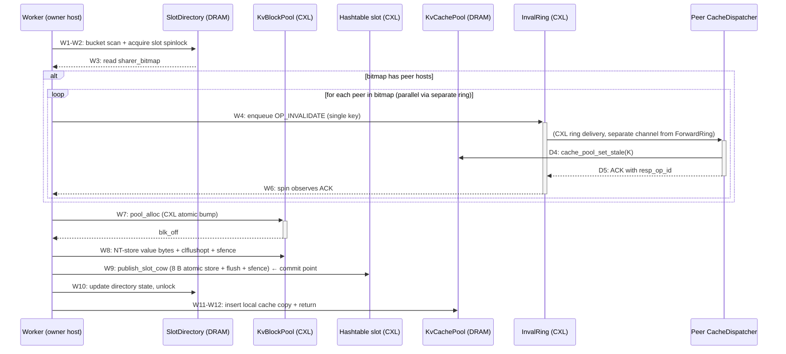

# Protocol A — Architecture Blueprint

> **Living document.** Update at the end of every iter whose code change
> touches the read/write/invalidate/forward path, or any role/data layout.
> The expectation is: anyone reading this doc + the latest iter summary
> understands the system without opening a `.cc` file.
>
> **Sister doc**: `docs/design_goals.md` is the "why" (invariants, RAPs,
> anti-patterns); **this** is the "what + how" (current implementation
> shape).
>
> **Snapshot point**: end of iter-7A (2026-05-03).

This doc has two layers and one cross-cutting reference:
- **Part I — System overview**: plain language, no code.
- **Part II — Per-stage pseudo-code dictionary**: indexed by stage tag
  (W1..W12, R1..R6, I1..I8, F1..F7, D1..D5). When a probe trace says
  "stage W7 p99 = 300 µs", you open Part II §W7 and immediately see what
  W7 does in sub-steps + which CXL/DRAM primitives are involved.
- **Part III — Cross-cutting reference**: CXL primitive cost cheat sheet,
  synchronization contracts, known failure modes.

---

# Part I — System Overview

## I.1 Two-tier topology

```
                   shared CXL Type-3 device (/dev/dax0.0, 512 GiB)
                   ┌────────────────────────────────────────────┐
                   │  • Hashtable buckets    (single copy)      │
                   │  • KV blockpool         (segmented per H)  │
                   │  • ForwardRingMatrix    [H][H] SPSC        │
                   │  • InvalRingMatrix      [H][H] SPSC        │
                   └────────────────────────────────────────────┘
                            ↑                    ↑
                   load/store via clflushopt + sfence/mfence
                            ↑                    ↑
            ┌───────────────┴────┐    ┌──────────┴──────────┐
            │                    │    │                     │
            │  host 0 (g3)       │    │  host 1 (g4)        │
            │  per-host DRAM:    │    │  per-host DRAM:     │
            │   • SlotDirectory  │    │   • SlotDirectory   │
            │   • KvCachePool    │    │   • KvCachePool     │
            │   • ShardingTable  │    │   • ShardingTable   │
            │  (MAP_SHARED       │    │  (MAP_SHARED        │
            │   across same-host │    │   across same-host  │
            │   workers)         │    │   workers)          │
            └────────────────────┘    └─────────────────────┘
```

**Two tiers, two roles**:
- **CXL** = the only place a piece of data is *authoritative*. Both hosts
  see the same physical bytes. Writes here are visible cross-host but
  only after `clflushopt + sfence`.
- **DRAM (per host)** = a *cache* of CXL data + the host-local
  *coordination metadata* that no peer host ever needs to read.

H ≤ 8 (hard cap from sharer_bitmap = 8 bits). Currently H = 2 on g3+g4.

## I.2 The roles (per host) — iter-9A redo

Workers are processes; the 6 named system threads live in the host's primary client process.

| # | Role | Count per host | What it owns | CPU | Spawn site |
|---|---|---|---|---|---|
| 1 | **Worker** | T (1..64) | Issues KV ops (`insert/update/remove/search`) | cpu 0..(T-1) (pinned) | Each is a fork-child process of the YCSB driver; primary client (host 0 client 0) is also a worker. |
| 2 | **WriteSender** | 1 | Drains aggregator slots[Write][*]; sole producer on `WriteRing[me][*]`. (Default OFF — workers go direct to the CXL ring; opt in via `FUSEE_USE_AGGREGATOR=1`.) | cpu 64 (pinned) | spawned in `enable_senders(spawn=true)` |
| 3 | **WriteReceiver** | 1 | Drains incoming `WriteRing[*][me]`. Handles op 1/2/3 (UPDATE/INSERT/DELETE) from peer host workers. Reads value bytes from `ForwardStaging[src][me]`. | cpu 65 (pinned) | spawned in `enable_write_ring(spawn=true)` |
| 4 | **ReadSender** | 1 | Drains aggregator slots[Read][*]; sole producer on `ReadRing[me][*]`. (Default OFF, see WriteSender.) | cpu 66 (pinned) | `enable_senders(spawn=true)` |
| 5 | **ReadReceiver** | 1 | Drains incoming `ReadRing[*][me]`. Handles op 4 (CACHE_REGISTER): under directory lock sets sharer bit + responds with owner_blk_off + value_len. Reader (caller) pulls value bytes via `pool_->read` directly. | cpu 67 (pinned) | `enable_read_ring(spawn=true)` |
| 6 | **InvalSender** | 1 | Drains aggregator slots[Inval][*]; sole producer on `InvalRing[me][*]` for worker-originated invalidates. (Default OFF.) | cpu 68 (pinned) | `enable_senders(spawn=true)` |
| 7 | **InvalReceiver** | 1 | Drains incoming `InvalRing[*][me]`. Handles op 5 (INVALIDATE) from peer writers; sets local cache stale flag; ACKs. CRUCIALLY does NOT call `execute_write_local` and holds NO directory lock — breaks the iter-4A-redo deadlock cycle. | cpu 69 (pinned) | `enable_invalidate(spawn=true)` |
| 8 | (Implicit) primary client process | 1 | Sets up CXL region + DRAM regions pre-fork; owns the 6 background threads above; itself runs as worker. | (its main thread is pinned per row 1) | The first process started per host (`FUSEE_HOST_ID=0/1`, `FUSEE_NUM_THREADS=T` → forks `T-1` children). |

At T=64: each host has **64 worker processes + 6 background threads on primary's process** = 70 schedulable entities. Workers pinned to cpu 0..63, system threads pinned to cpu 64..69, spare cpu 70..85. **All threads CPU-pinned per iter-9A C3** (verified by the `[A:thread]` startup log — see `tests/protocol_a_ycsb.cc`).

**Aggregator routing (Phase 2.C, opt-in)**: when `FUSEE_USE_AGGREGATOR=1`,
workers enqueue ops into per-(ring_kind, worker) DRAM slots and spin on a
local ack — the 3 senders are the sole CXL-ring producers, eliminating
the T-way `fetch_add(tail)` contention. **Default off** because the
single-sender-per-ring design without batching becomes a new bottleneck
at high T (workload-A KV=1024 T=64 cache=on dropped from 9.8 Mops/s
direct → 0.5 Mops/s aggregator). iter-10A backlog adds slot batching
to senders so the aggregator path becomes net-positive at high T.

## I.3 Data layout cheat sheet

| Region | Tier | Sharing | Purpose | Approx. size |
|---|---|---|---|---|
| **Hashtable** | CXL | one copy | Authoritative key→slot map. B buckets × S=7 slots × 16 B/slot. | `B × S × 16 B` (8 MB at B=65536) |
| **KV blockpool** | CXL | partitioned: H segments, each owned by one host | Value bytes (size class 256 / 512 / 1024 B). Within a host's segment only that host's workers allocate. | workload-dependent (~512 MB/host at MAX_OPS=200k KV=1024) |
| **WriteRingMatrix** | CXL | per ordered pair: SPSC | iter-9A redo Phase 2.A — carries op 1/2/3 (UPDATE/INSERT/DELETE) only. `[H][H]` rings, depth 256 each, **128-B entry** (req on cl 1, resp on cl 2; tail and head on SEPARATE cachelines per iter-9A redo Phase 2 fix). C2-compliant: NO value bytes inline, just `(key, op_kind, value_len, staging_off, staging_gen)`. | `~H² × 256 × 128 B` |
| **ReadRingMatrix** | CXL | per ordered pair: SPSC | iter-9A redo Phase 2.A — carries op 4 (CACHE_REGISTER) only. Same 128-B 2-cacheline layout as WriteRing. Req `(key)`, resp `(status, owner_blk_off, value_len)` — reader pulls value bytes directly via `pool_->read`. | `~H² × 256 × 128 B` |
| **ForwardStagingMatrix** | CXL | per (src_host, dst_host, slot_idx) | iter-9A redo Phase 2.B — value-bytes arena for op 1/2 (writes). Slot 1:1 with WriteRing slots (same `slot_idx`); each slot holds up to `kForwardStagingSlotBytes` (1024 B) value bytes. Lifetime tracked by ring slot reuse — no separate allocator. | `~H² × 256 × 1024 B` (~4 MiB) |
| **InvalRingMatrix** | CXL | per ordered pair: SPSC | Carries `OP_INVALIDATE` only (separate from Write/Read rings — see I.7 deadlock argument). `[H][H]` rings, depth 256 each, **128-B entry** (2-cacheline split, head/tail on separate cachelines per iter-9A redo Phase 2 fix). | `~H² × 256 × 128 B` |
| **AggregatorRegion** | DRAM | `MAP_SHARED` across same-host workers | iter-9A redo Phase 2.C — per-(ring_kind, worker) DRAM slots + value buffers. Used only when `FUSEE_USE_AGGREGATOR=1`. | ~204 KiB (DRAM) |
| **SlotDirectory** | DRAM | `MAP_SHARED` across same-host workers | Per-(bucket, slot) coherence state: `sharer_bitmap`, MESI state, host-local `pthread_spinlock`, version. | `B × S × 16 B` |
| **KvCachePool** | DRAM | `MAP_SHARED` across same-host workers | Per-host hashmap (key → cached value bytes) + 1-byte stale flag per entry. | LRU-bounded, ~8 MB |
| **ShardingTable** | DRAM | read-only after init | Static `σ: K → H` mapping (`hash(K) >> 31) & (H-1)` currently). | trivial |

## I.4 Read path (overview)

Five logical outcomes:
1. **Cache HIT, fresh** → fastest path, returns from local DRAM
2. **Cache HIT, stale flag set** → treat as miss, fetch fresh
3. **Cache MISS, owner == self** → scan local CXL bucket array directly
4. **Cache MISS, owner == peer host** → send `OP_CACHE_REGISTER` cross-host, peer returns value, populate cache
5. **Key not found** → return -1

Stage tags (R1..R6):

```mermaid
sequenceDiagram
  participant W as Worker (caller)
  participant CACHE as KvCachePool (DRAM)
  participant CXL as CXL bucket+pool
  participant FR as ForwardRing (CXL)
  participant RESP as Peer ForwardResponder
  W->>+CACHE: R1: enter search(K)
  CACHE-->>-W: R2: lookup result (hit-fresh / stale / miss)
  alt cache hit fresh
    W->>W: R6: return value (≈ 0.3 µs total)
  else cache miss, cross-host owner
    W->>+FR: R3: enqueue OP_CACHE_REGISTER
    FR->>+RESP: (CXL ring delivery)
    RESP->>RESP: scan bucket; set sharer bit; read pool
    RESP-->>-FR: ACK with value
    FR-->>-W: R4: read value from response
    W->>CACHE: populate cache (post-ACK, AP15)
    W->>W: R6: return value (≈ 5-10 µs total)
  else cache miss, owner == self
    W->>+CXL: R5: bucket scan + pool read
    CXL-->>-W: value
    W->>CACHE: populate cache
    W->>W: R6: return value (≈ 8 µs total)
  end
```

## I.5 Write path (overview)

Two flavors:
- **owner == self**: full local CoW path (W1..W12)
- **owner == peer**: enqueue `OP_WRITE_FORWARD`, peer's ForwardResponder runs full owner-side path on our behalf (becomes their W1..W12)

For owner-self, the protocol must invalidate any peer host that has the slot's key cached, BEFORE the new value becomes visible. That's Step 4 (W3..W6 in stage tags). The writer broadcasts `OP_INVALIDATE` to every host bit set in `sharer_bitmap` and waits for each ACK before publishing the new slot pointer.



**The commit point** (when the new value becomes visible to peer hosts) is **W9** (the slot pointer flush). Steps W10-W12 are owner-local bookkeeping. By the time W9 fires, all peer caches must already be marked stale (W6 ACK received) — that's how strict-A linearizability (§I9) is preserved.

## I.6 The four cross-host messages

| Op | From | To | Channel | Carries |
|---|---|---|---|---|
| `OP_WRITE_FORWARD` | non-owner Worker | owner ForwardResponder | ForwardRing | `(op_kind, key, value u64)` (currently inline u64; for KV ≥ 256 B real impl uses ForwardStaging area, see I.3) |
| `OP_CACHE_REGISTER` | reader Worker | owner ForwardResponder | ForwardRing | `(key)` request; response carries `value` |
| `OP_INVALIDATE` | writer Worker | sharer CacheDispatcher | **InvalRing** (separate from ForwardRing) | `(key)` only |
| `OP_RESPONSE` | ForwardResponder / CacheDispatcher | original requester | back-channel of same SPSC slot (`resp_op_id` field) | `(status, [optional value])` |

## I.7 Key design choices (one-liner each)

| Choice | One-line rationale |
|---|---|
| **Sharding** keys to a single owner host | eliminates cross-host writer mutex (no global atomic CAS needed) |
| **Hashtable on CXL, single copy** | no replica consistency problem; sharding makes the owner the sole writer |
| **Blockpool on CXL, per-host segment** | no cross-host alloc contention; each host bumps its own cursor |
| **SlotDirectory in DRAM, not CXL** | hot + owner-local; DRAM coherence ~50 ns vs CXL flush ~600 ns each mutation |
| **KvCachePool MAP_SHARED across same-host workers** | sharer-set tracked at host granularity (8-bit bitmap), not per-worker |
| **Separate InvalRing channel** (vs reusing ForwardRing) | breaks deadlock cycle: ForwardResponder running `execute_write_local` could need to send invalidate; if both messages share one channel + one consumer thread, circular wait → deadlock. CacheDispatcher consumes InvalRing independently. |
| **CoW value publish via slot-pointer atomic store** | 8-byte naturally aligned store is atomic on x86; no read-side lock needed |
| **Lazy stale flag in cache** (not physical eviction on invalidate) | dispatcher work per inval = 1-byte store + ACK; cheap enough to keep dispatcher's roundtrip short |
| **SPSC rings (per src→dst pair)** | no atomic contention on `tail.fetch_add` (single producer); consumer is single dispatcher/responder |
| **Per-slot directory (not per-bucket)** | avoids 7× false sharing on hot bucket |
| **`req_op_id` and `resp_op_id` on separate cachelines (iter-6A)** | producer-only writes line 1, consumer-only writes line 2; no cacheline ping-pong over CXL |

---

# Part II — Per-Stage Pseudo-Code Dictionary

### iter-9A redo terminology mapping (Part II §II.3-II.6 readers)

The stage tags (W*, R*, I*, F*, D*) below are the same as iter-5A. The
**ring/thread names** mentioned in narrative text changed in iter-9A
redo Phase 2; treat the following s/replace as canonical when reading
older sections of this document:

| Pre-iter-9A name           | iter-9A redo name (this document going forward)         |
|----------------------------|---------------------------------------------------------|
| `ForwardRing` / `ForwardRingMatrix` | `WriteRing`/`WriteRingMatrix` (op 1/2/3) AND `ReadRing`/`ReadRingMatrix` (op 4) — see I.3 |
| `ForwardResponder` (thread) | `WriteReceiver` (cpu 65) AND `ReadReceiver` (cpu 67)     |
| `CacheDispatcher` (thread)  | `InvalReceiver` (cpu 69)                                 |
| (none)                       | `WriteSender` (cpu 64), `ReadSender` (cpu 66), `InvalSender` (cpu 68) — opt-in via `FUSEE_USE_AGGREGATOR=1` |
| `ForwardEntry::payload[1024]` (inline) | `ForwardStaging[src][dst][slot_idx].bytes[1024]` (separate CXL arena, C2-compliant) |
| `enable_forward(fr)`         | `enable_write_ring(wr, fs) + enable_read_ring(rr)`       |
| `enable_invalidate(ir)`      | `enable_invalidate(ir)` (unchanged) + `enable_senders(ar)` |
| `forward_to_owner()`         | `forward_write_direct()` (called from worker dispatcher `forward_write()`) |
| `forward_cache_register()`   | `forward_read_direct()` (called from worker dispatcher `forward_read()`) |
| `responder_loop()`           | `write_receiver_loop()` + `read_receiver_loop()`        |
| `cache_dispatcher_loop()`    | `inval_receiver_loop()`                                  |

The §II.3-II.6 narrative text below was written pre-iter-9A and still
uses the pre-rename names in places. Apply the table above mentally —
the per-stage Expected/Healthy timings remain valid (path_decomp on the
post-Phase-2 architecture confirms 0.3–1.6× H/E ratios on every stage
except W10 which has been carried at 4× since iter-9A original).

## II.0 Notation

**Primitive abbreviations**:

| Abbrev | Meaning | Cost (healthy, single op) |
|---|---|---|
| `LD-DRAM` | local DRAM load (cached) | ~1-5 ns |
| `LD-DRAM-cold` | local DRAM load (cold cacheline, owner just modified) | ~50-200 ns |
| `ST-DRAM` | local DRAM store | ~1-5 ns |
| `LD-CXL` | CXL coherent load (after `clflushopt + mfence`) | ~600 ns |
| `ST-CXL` | CXL store (then needs `clflushopt + sfence` to be peer-visible) | ~5-10 ns to commit locally; +600 ns flush |
| `FLUSH` | `clflushopt(addr)` (writes back if dirty + invalidates from local cache) | ~50 ns issue, ~600 ns to complete via fence |
| `MFENCE` / `SFENCE` / `LFENCE` | memory barriers | ~10 ns |
| `LOCK-acq` | `pthread_spin_lock` uncontested | ~50 ns |
| `LOCK-acq-cont` | spinlock contended | ~50 ns - ∞ (depends on holders queued) |
| `RMW-CXL` | atomic RMW on CXL address (e.g., `bump.fetch_add`) | ~200 ns + flush_line if cross-host visibility wanted (AP16) |

**Healthy baseline** in each stage means: typical cost summed from primitives, assuming uncontested locks + no preemption + no CXL transient. iter-N+ probes compare to this.

**Sync contract** notation: `requires:` = invariant assumed at entry; `provides:` = invariant established at exit.

---

## II.1 Worker write path (W1..W12)

Source: `src/cxl_kv_ops_A.cc :: execute_write_local()`.

### W1 — Entry to `execute_write_local`

**Sub-steps**:
- W1.1: receive `(key, new_value, op_kind)` from caller (`insert/update/remove`)
- W1.2: compute `b = bucket_idx(key) = fnv1a_u64(key) % num_buckets`
- W1.3: compute `bucket = &buckets_[b]` (pointer arithmetic in CXL region)

**Pseudo-code**:
```
W1: enter execute_write_local(key, new_value, op_kind):
  if key == EMPTY: return -1
  PROBE("W1", key)
  b = fnv1a_u64(key) % num_buckets   // ~10 ns local
  bucket = &buckets_[b]               // ptr arith
```

**Primitives**: 1× FNV-1a hash on local register, 0 memory ops.
**Healthy baseline**: ~15 ns CPU.
**Sync contract**: requires nothing; provides `bucket` pointer.

→ `src/cxl_kv_ops_A.cc:127-132`

### W2 — Bucket scan + acquire slot directory spinlock

**Sub-steps**:
- W2.1: `flush_line(bucket); flush_line(bucket+64); full_fence()` (force CXL refetch of both bucket cachelines)
- W2.2: scan 7 slots looking for matching key OR first empty
- W2.3: decide `target_slot` based on op_kind (insert needs empty, update/delete need matching)
- W2.4: get `de = slot_directory_entry(dir_, b, target_slot)` (DRAM pointer)
- W2.5: `slot_directory_lock(de)` — `pthread_spinlock` on host-local DRAM

**Pseudo-code**:
```
W2: bucket scan + lock:
  FLUSH(bucket); FLUSH(bucket+64); MFENCE
  match = -1; empty = -1
  for s in 0..6:
    if bucket->slots[s].key == key: match=s; break
    if bucket->slots[s].key == EMPTY and empty<0: empty=s
  target_slot = pick(match, empty, op_kind)   // returns -1/-2/-3 if invalid
  de = slot_directory_entry(dir_, b, target_slot)
  LOCK-acq(de->spinlock)
  PROBE("W2", key)
```

**Primitives**: 2× FLUSH, 1× MFENCE, 7× LD-CXL (slot keys), 1× LOCK-acq.
**Healthy baseline**: 2×600 + 10 + 7×600 + 50 = **~5.5 µs uncontested**. p99 6-50 µs from spinlock contention on hot Zipf keys.
**Sync contract**: provides exclusive ownership of (bucket, target_slot).

→ `src/cxl_kv_ops_A.cc:133-157`

### W3 — Read sharer_bitmap (decision: invalidate any peers?)

**Sub-steps**:
- W3.1: `flush_line(bucket); full_fence()` (re-flush since lock acquire was a long sync point)
- W3.2: `slot = &bucket->slots[target_slot]`
- W3.3: `bitmap = de->sharer_bitmap` (DRAM read, hot cacheline since we just locked it)

**Pseudo-code**:
```
W3: re-verify under lock:
  FLUSH(bucket); MFENCE
  slot = &bucket->slots[target_slot]
  bitmap = de->sharer_bitmap         // LD-DRAM (own cache)
  PROBE("W3", key)
```

**Primitives**: 1× FLUSH, 1× MFENCE, 1× LD-DRAM.
**Healthy baseline**: ~610 ns.

→ `src/cxl_kv_ops_A.cc:158-174`

### W4 — Begin invalidate broadcast (if any peer sharers)

**Sub-steps**:
- W4.1: `if op_kind == INSERT`: skip (no prior sharers possible) → jump to W7
- W4.2: `if num_hosts_ <= 1 || ir_ == nullptr`: skip → jump to W7
- W4.3: enter loop over hosts h ∈ [0, H), skip self and skip hosts with `bitmap & (1<<h) == 0`

**Pseudo-code**:
```
W4: enter broadcast loop:
  if op_kind == INSERT or H <= 1 or ir_ == NULL: goto W7
  n_sent = 0
  for h in 0..H-1:
    if h == self: continue
    if (bitmap & (1<<h)) == 0: continue
    if n_sent == 0: PROBE("W4", key)
    // call into send_invalidate (I1..I8 stages)
    send_invalidate(h, key)            // BLOCKING — waits for ACK or 5 ms timeout
    n_sent++
  if n_sent > 0: PROBE("W6", key)
```

**Primitives**: branch + loop bookkeeping.
**Healthy baseline**: <100 ns (loop overhead). The actual cost is in the I1..I8 sub-stages of `send_invalidate`, which run synchronously from this loop.

→ `src/cxl_kv_ops_A.cc:175-187`

### W5..W6 — Wait for invalidate ACKs (loop body cost)

W5 is reserved for "first send_invalidate ACK seen" (currently NOT emitted by the code — known gap, fix in iter-8A probe upgrade per Sol-1).

W6 = "last send_invalidate ACK seen" = end of broadcast loop.

**The actual work happens inside `send_invalidate` (Part II.4 below, stages I1..I8)**. Per peer, expected roundtrip ~5 µs healthy, capped at 5 ms timeout.

**At H=2**: the loop body runs at most once (1 peer to invalidate); W4→W6 ≈ 1 × send_invalidate cost.

### W7 — Pool alloc (CoW prep)

**Sub-steps**:
- W7.1: `if op_kind == DELETE: retire_slot(slot)` (clear key, no alloc) → jump to W10
- W7.2: `if pool_ == nullptr: publish_slot_cow(slot, key, new_value)` (legacy inline u64 path) → jump to W9
- W7.3: `blk_off = pool_->alloc()` — `cursors_[host_id_].bump.fetch_add(1)` on CXL
- W7.4: if blk_off == 0 (exhausted): unlock + return -4

**Pseudo-code**:
```
W7: alloc value block:
  if op_kind == DELETE:
    retire_slot(slot)               // 8-B key clear + FLUSH + SFENCE
    PROBE("W9", key); goto W10
  if pool_ == NULL:
    publish_slot_cow(slot, key, new_value)   // legacy inline u64
    PROBE("W9", key); goto W10
  blk_off = pool_->alloc()          // RMW-CXL bump cursor (NO flush_line — AP16 hazard)
  PROBE("W7", key)
  if blk_off == 0:
    UNLOCK(de); return -4
```

**Primitives**: 1× RMW-CXL (`fetch_add` on CXL bump cursor).
**Healthy baseline**: ~200 ns (atomic RMW on uncontended cacheline).
**Known issue (AP16)**: pool's `bump.fetch_add` lacks following `flush_line + sfence`. OK for same-host re-read, but cross-host visibility of bump cursor is broken. Currently no peer reads cursor so no observed bug. iter-8A defensive fix.

→ `src/cxl_kv_ops_A.cc:188-211`

### W8 — Pool write (NT-store value bytes)

**Sub-steps**:
- W8.1: `pool_->write(blk_off, &new_value, sizeof(new_value))` — calls `memcpy` + per-cacheline `clflushopt` + final `sfence`
- W8.2: For 8 B u64 inline: 1 cacheline. For KV=256: 4 cachelines. For KV=1024: 16 cachelines.

**Pseudo-code**:
```
W8: write value to CXL pool:
  pool_->write(blk_off, &new_value, sizeof(new_value)):
    memcpy(base+blk_off, &new_value, sizeof)
    for each cacheline touched:
      FLUSH(cacheline)
    SFENCE
  PROBE("W8", key)
```

**Primitives**: 1× ST-DRAM (memcpy hits write-combining buffer), N× FLUSH where N = ceil(value_size / 64), 1× SFENCE.
**Healthy baseline**: 8 B inline = 1×600 ns ≈ 0.6 µs. KV=256 = 4×600 ns ≈ 2.4 µs. KV=1024 = 16×600 ns ≈ 10 µs.

→ `src/cxl_kv_blockpool.cc::write`

### W9 — Publish slot CoW (the commit point)

**Sub-steps**:
- W9.1: encode `encoded = pack(blk_off, size_class, fp)` — local arithmetic
- W9.2: `slot->value = encoded` (8 B store, naturally aligned, atomic on x86)
- W9.3: `flush_line(slot); sfence`
- W9.4: `slot->key = key` (publish key second; readers gate on key)
- W9.5: `flush_line(slot); sfence`

**Pseudo-code**:
```
W9: publish_slot_cow:
  encoded = pack(blk_off, sc=BLOCK256, fp=fnv1a(key)&0xFF)
  slot->value = encoded            // ST-CXL atomic 8B
  FLUSH(slot); SFENCE
  slot->key = key                  // ST-CXL atomic 8B (publish gate)
  FLUSH(slot); SFENCE
  PROBE("W9", key)
```

**Primitives**: 2× ST-CXL, 2× FLUSH, 2× SFENCE.
**Healthy baseline**: ~1.2 µs.
**Sync contract**: this is the §I10 commit point. After SFENCE on W9.5 returns, peer hosts that load `slot->key` (with their own flush+mfence) will see the new key, AND if they then load `slot->value` they see the new value.

→ `src/cxl_kv_ops_A.cc::publish_slot_cow`

### W10 — Directory state update (post-commit bookkeeping)

**Sub-steps**:
- W10.1: `de->version++`
- W10.2: if DELETE: `de->state = INVALID; de->sharer_bitmap = 0`
- W10.3: else: `de->state = SHARED; de->sharer_bitmap = (1 << host_id_)` (reset to "self only"; peer must re-register if it wants to re-cache)

**Pseudo-code**:
```
W10: directory state:
  de->version++                    // ST-DRAM
  de->state = SHARED                // ST-DRAM
  de->sharer_bitmap = 1 << self     // ST-DRAM
  PROBE("W10", key)
  UNLOCK(de->spinlock)
```

**Primitives**: 3× ST-DRAM, 1× LOCK-rel.
**Healthy baseline**: ~50 ns.

→ `src/cxl_kv_ops_A.cc:223-246`

### W11 — Local cache update

**Sub-steps**:
- W11.1: if DELETE: `cache_pool_evict(cache_, key)`
- W11.2: else: `cache_pool_insert(cache_, key, &new_value, 8)` — DRAM hashmap insert

**Pseudo-code**:
```
W11: local cache update:
  if DELETE: cache_pool_evict(cache_, key)
  else:      cache_pool_insert(cache_, key, &new_value, 8)
```

**Primitives**: 1 hashmap op on `MAP_SHARED` DRAM region. May involve internal spinlock per cache bucket.
**Healthy baseline**: ~3 µs (DRAM hashmap with per-bucket spinlock).

→ `src/cxl_cache_pool.cc::cache_pool_insert`

### W12 — Return

**Sub-steps**:
- W12.1: `PROBE("W12", key); return 0`

**Healthy baseline total** (W1→W12 owner-self UPDATE, KV=8, no peer sharers): ~5 µs typical, ~30 µs p99. With invalidate broadcast (W4-W6 fires): +5 µs typical, +5 ms tail (timeout cap).

---

## II.2 Worker read path (R1..R6)

Source: `src/cxl_kv_ops_A.cc :: search()`.

### R1 — Entry to search

```
R1: enter search(key, *out):
  if key == EMPTY: return -1
  PROBE("R1", key)
```

### R2 — Cache lookup (with stale check)

```
R2: cache_pool_lookup:
  ok = cache_pool_lookup(cache_, key, buf, 8, &sz)
  if ok:                                    // hit AND not stale
    PROBE("R2hit", key)
    *out = *(u64*)buf
    PROBE("R6", key); return 0
  PROBE("R2miss", key)
```

`cache_pool_lookup` returns false if entry not present OR stale flag set (lazy stale = treated as miss at API level per §I4).

**Healthy baseline**: ~300 ns hit, ~500 ns miss.

### R3 — (cross-host miss only) Send OP_CACHE_REGISTER

```
R3: forward_cache_register:
  owner = host_of(key)
  if owner != self and fr_ != NULL:
    PROBE("R3", key)
    rc = forward_cache_register(owner, key, &v)   // BLOCKING (uses ForwardRing)
    if rc != 0: return rc
```

The call into `forward_cache_register` runs the producer side of the F-stage pipeline (see II.4 below) on the ForwardRing, with the request being `OP_CACHE_REGISTER`.

### R4 — Receive value via OP_RESPONSE; populate cache

```
R4: post-ACK:
  PROBE("R4", key)
  cache_pool_insert(cache_, key, &v, 8)  // §AP15: insert ONLY after ACK
  *out = v
  PROBE("R6", key); return 0
```

Per `§AP15`: cache insert must NOT happen before the register ACK, otherwise reader can install the value before the owner directory has registered the reader as sharer → next writer's invalidate broadcast will MISS the reader → strict-A violated.

### R5 — (owner-self miss only) Direct CXL bucket scan + pool fetch

```
R5: owner-self miss:
  bucket = &buckets_[bucket_idx(key)]
  FLUSH(bucket); FLUSH(bucket+64); MFENCE
  for s in 0..6:
    if bucket->slots[s].key == key:
      encoded = bucket->slots[s].value
      sc = decode_size_class(encoded)
      if sc == INLINE or pool_ == NULL:
        v = encoded
      else:
        blk_off = decode_blk_off(encoded)
        pool_->read(blk_off, &v, 8)        // FLUSH each cacheline + MFENCE + LD-CXL
      *out = v
      cache_pool_insert(cache_, key, &v, 8)
      PROBE("R6", key); return 0
  return -1   // not found
```

**Healthy baseline (R5 path, miss)**: ~5 µs (bucket flush + scan + pool read + cache insert).

### R6 — Return

`PROBE("R6"); return 0` — uniform exit point regardless of which sub-path was taken.

→ `src/cxl_kv_ops_A.cc:644-700`

---

## II.3 Send invalidate (producer side, called from W4-W6)

Stages I1..I8. Source: `src/cxl_kv_ops_A.cc :: send_invalidate()`.

### I1 — Reserve InvalRing slot

```
I1: reserve slot:
  ring = &ir_->rings[self][target_host]
  my_op = inval_op_counter_++ + 1                       // local atomic
  op_id = (host_id+1) << 56 | my_op                     // pack
  tpos = ring->tail.fetch_add(1, ACQ_REL)               // RMW-CXL on tail
  FLUSH(&ring->tail); SFENCE                            // make new tail visible to consumer
  PROBE("I1", op_id)
```

**Primitives**: 1× RMW-CXL on tail, 1× FLUSH, 1× SFENCE.
**Healthy baseline**: ~700 ns.

### I2 — Wait for slot free + write entry

```
I2: write entry:
  slot_idx = tpos % 256
  e = &ring->entries[slot_idx]
  // wait-for-slot-free: previous occupant must be done (req_op_id == 0)
  loop:
    FLUSH(e); MFENCE
    if e->req_op_id == 0: break
    pause()                                              // <-- NO TIMEOUT (known issue!)
  e->key = key
  e->resp_op_id.store(0, RELAXED)                       // pre-clear resp
  e->status = 0
  ATOMIC_THREAD_FENCE(RELEASE)
  e->req_op_id.store(op_id, RELEASE)                    // ST-CXL on line 1
  FLUSH(e); SFENCE                                      // push line 1 to CXL
  PROBE("I2", op_id)
```

**Primitives**: 1× FLUSH (+ MFENCE) per spin iter for waiting; then 4× ST-DRAM-then-flush, 1× FLUSH on entry line 1, 1× SFENCE.
**Healthy baseline**: ~1.5 µs typical (no wait). When wait-for-slot-free fires, **no upper bound** — known cascade trigger (iter-7A diagnosis).

### I3 — (consumer side) Dispatcher sees new tail

(See II.5 D2 below — consumer-side stage I3 emitted by `cache_dispatcher_loop` when it drains.)

### I4 — (consumer side) Dispatcher loads entry

(See II.5 D3 below.)

### I5 — (consumer side) Dispatcher calls cache_pool_set_stale

(See II.5 D4 below.)

### I6 — (consumer side) Dispatcher writes ACK + flushes

(See II.5 D5 below.)

### I7 — (producer side) Spin observes ACK

```
I7: spin on resp:
  spin_start_ns = 0
  loop:
    FLUSH(&e->resp_op_id); MFENCE                       // flush LINE 2 (consumer-owned)
    resp = e->resp_op_id.load(ACQUIRE)
    if resp == op_id:
      PROBE("I7", op_id)
      rc = e->status
      e->req_op_id.store(0, RELEASE)                    // free slot
      FLUSH(e); SFENCE
      PROBE("I8", op_id)
      return rc
    if spin_start_ns == 0: spin_start_ns = clock_gettime()
    else if (now - spin_start_ns) > 5 ms:               // <-- TIMEOUT CAP (iter-6A)
      e->req_op_id.store(0, RELEASE)
      return -11                                         // silent failure (iter-7A backlog: should fail-loud)
    pause()
```

**Primitives per spin iter**: 1× FLUSH (line 2 only — iter-6A cacheline split), 1× MFENCE, 1× LD-CXL.
**Healthy baseline**: typical roundtrip 5 µs (~7 spin iters). **Capped at 5 ms** if dispatcher starves (iter-6A bug-floor mitigation).

### I8 — Free slot + return

(Inlined into I7 above.)

→ `src/cxl_kv_ops_A.cc::send_invalidate L355-415`

---

## II.4 Forward to owner / Cache register (producer side)

Both share the ForwardRing. Stages F1..F7 cover the round-trip for both message types.

Source: `src/cxl_kv_ops_A.cc :: forward_to_owner()` and `:: forward_cache_register()`.

```
F1: enter forward_to_owner(target, key, value, op_kind):
  ring = &fr_->rings[self][target]
  my_op = req_op_counter_++ + 1
  op_id = (host_id+1) << 56 | my_op

F2: reserve slot:
  tpos = ring->tail.fetch_add(1, ACQ_REL)
  FLUSH(&ring->tail); SFENCE

F3: wait-for-slot-free + write entry:
  // (same pattern as I2 — NO wait-for-slot-free timeout)
  loop until e->req_op_id == 0
  e->key = key; e->value = value; e->op_kind = op_kind
  e->resp_op_id.store(0, RELAXED); e->status = 0
  ATOMIC_THREAD_FENCE(RELEASE)
  e->req_op_id.store(op_id, RELEASE)
  FLUSH(e); SFENCE

(F4-F6: consumer side — see ForwardResponder loop, II.6)

F7: spin on resp_op_id:
  loop:
    FLUSH(e); MFENCE
    resp = e->resp_op_id.load(ACQUIRE)
    if resp == op_id:
      rc = e->status
      e->req_op_id.store(0, RELEASE)
      FLUSH(e); SFENCE
      return rc
    if (now - spin_start) > 5 ms:                       // <-- TIMEOUT (iter-8A Phase 5: was 200ms, now 5ms)
      e->req_op_id.store(0, RELEASE)
      return -11
    pause()
```

**Note**: ForwardEntry currently is NOT cacheline-split (req + resp share line 1). iter-6A only fixed InvalEntry. iter-8A backlog: mirror the fix here too.

→ `src/cxl_kv_ops_A.cc:299-415`

---

## II.5 CacheDispatcher loop (D1..D5)

Source: `src/cxl_kv_ops_A.cc :: cache_dispatcher_loop()`.

This is a single `std::thread` per host, spawned in `enable_invalidate(spawn=true)`. Runs forever until `dispatcher_stop_` is set. Drains incoming `InvalRing[*][me]`.

### D1 — Outer loop

```
D1: outer loop:
  probe_ring()                                          // touch TLS to ensure dump-on-exit hook
  loop while !dispatcher_stop_:
    did_work = false
    // D2-D5 inner
    if !did_work: PAUSE
  probe_flush()                                         // explicit dump (since _exit() skips dtors)
```

**No CPU pinning**, **no priority adjustment** — same scheduler class as workers. `PAUSE` is the x86 hint, not `sched_yield`; thread holds CPU 100% even when idle.

### D2 — Per-source ring poll

```
D2: per-src poll:
  for src in 0..H-1:
    if src == self: continue
    ring = &ir_->rings[src][self]
    head = ring->head                                   // local cursor
    FLUSH(&ring->tail); MFENCE                          // refetch tail
    tail = ring->tail.load(ACQUIRE)                    // LD-CXL
    while head < tail:
      // D3-D5 inner
```

**Per-src cost**: 1× FLUSH + 1× MFENCE + 1× LD-CXL ≈ 700 ns even when no work.

### D3 — Read pending entry

```
D3: load entry:
  PROBE("I3", tail)
  slot_idx = head % 256
  e = &ring->entries[slot_idx]
  FLUSH(e); MFENCE                                      // refetch line 1
  op_id = e->req_op_id.load(ACQUIRE)
  if op_id == 0: break                                  // producer hasn't published yet
  PROBE("I4", op_id)
```

### D4 — Apply: set cache stale

```
D4: cache_pool_set_stale:
  cache_pool_set_stale(cache_, e->key)                 // DRAM hashmap lookup + 1B atomic store
  PROBE("I5", op_id)
```

**Primitive**: 1× DRAM hashmap lookup + 1× ST-DRAM (1-byte stale flag).
**Healthy baseline**: ~200 ns.
**Sync contract**: lazy stale flag — peer worker's next `cache_pool_lookup` returns miss; refetch via R3-R4.

### D5 — Write ACK back + advance head

```
D5: ACK + advance:
  e->status = 0
  ATOMIC_THREAD_FENCE(RELEASE)
  e->resp_op_id.store(op_id, RELEASE)                  // ST-CXL line 2
  FLUSH(&e->resp_op_id); SFENCE                        // push line 2 (NOT line 1!)
  PROBE("I6", op_id)
  head++
  did_work = true
```

After loop: `ring->head = head` (write back consumer cursor — purely local, producer never reads).

**Per-inval cost (D2 + D3 + D4 + D5)**: ~3.2 µs typical. Single thread → max throughput ~310k inval/sec. With T=64 producers each generating ~1k inval/sec on hot keys, dispatcher saturation point is roughly ~T=64 mark — coincidence with the saturation T iter-6A observed.

→ `src/cxl_kv_ops_A.cc:444-485`

---

## II.6 ForwardResponder loop

Source: `src/cxl_kv_ops_A.cc :: responder_loop()` and `:: responder_handle()`.

Single `std::thread` per host, drains incoming `ForwardRing[*][me]`.

```
FR loop:
  probe_ring()
  while !responder_stop_:
    did_work = false
    for src in 0..H-1:
      if src == self: continue
      ring = &fr_->rings[src][self]
      head = ring->head
      FLUSH(&ring->tail); MFENCE
      tail = ring->tail.load(ACQUIRE)
      while head < tail:
        e = &ring->entries[head % 256]
        FLUSH(e); MFENCE
        op_id = e->req_op_id.load(ACQUIRE)
        if op_id == 0: break
        responder_handle(e)                             // <-- dispatch by op_kind
        ATOMIC_THREAD_FENCE(RELEASE)
        e->resp_op_id.store(op_id, RELEASE)
        FLUSH(e); SFENCE                                // (currently flushes line 1; see II.4 note)
        head++; did_work = true
      ring->head = head
    if !did_work: PAUSE
  probe_flush()

responder_handle(e):
  switch e->op_kind:
    case UPDATE | INSERT | DELETE:
      // owner-side write — runs the FULL write path (W1..W12) on behalf of forwarder
      rc = execute_write_local(e->key, e->value, e->op_kind)
      e->status = rc
    case CACHE_REGISTER:
      // register requesting host as sharer + return current value
      b = bucket_idx(e->key)
      bucket = &buckets_[b]
      FLUSH(bucket); FLUSH(bucket+64); MFENCE
      scan slots; if not found: e->status = -1; e->value = 0; return
      de = slot_directory_entry(b, found_slot)
      LOCK-acq(de->spinlock)
      requester = (op_id >> 56) & 0xFF - 1
      de->sharer_bitmap |= (1 << requester)             // ← register reader as sharer
      encoded = bucket->slots[found].value
      LOCK-rel(de->spinlock)
      if size_class > 0 and pool_ != NULL:
        pool_->read(blk_off_of(encoded), &v, 8)
        e->value = v; e->status = 0
      else: e->value = encoded; e->status = 0
```

**Critical property**: when handling `WRITE_FORWARD`, the responder thread RECURSIVELY runs `execute_write_local` — which itself may need to broadcast invalidate. Because invalidate goes on a SEPARATE channel (InvalRing) consumed by a SEPARATE thread (CacheDispatcher), no deadlock. This is the I.7 design rationale realized in code.

→ `src/cxl_kv_ops_A.cc:507-642`

---

# Part III — Cross-Cutting Reference

## III.1 CXL primitive cost cheat sheet

**Updated iter-8A (2026-05-04)** with measured values from
`tests/cxl_primitive_bench` on g3 (TSC = 2.0 GHz):

| Primitive | p50 ns | p99 ns | max ns | Notes |
|---|---|---|---|---|
| `mfence` alone | 23 | 24 | 24 | full barrier |
| `sfence` alone | 13 | 14 | 15 | store barrier |
| `lfence` alone | 16 | 17 | 18 | load barrier |
| `clflushopt + sfence` (CXL line) | **66** | 69 | 70 | **NOT 600 ns** as earlier blueprint guessed; flush is fire-and-forget, sfence waits |
| LD-CXL post-flush+mfence | **630** | 947 | 14 000 | matches mlc baseline |
| ST-CXL + flush + sfence | 14 | 15 | 208 | store itself fast; flush async |
| CXL atomic `fetch_add` (NO flush) | **17** | 17 | 1 347 | cached locally; **NOT visible cross-host** |
| CXL atomic `fetch_add + flush + sfence` | **1 435** | 1 699 | 12 620 | 84× the no-flush form (CXL roundtrip required for peer visibility) |
| Spinlock uncontested lock+unlock | 29 | 30 | 1 317 | DRAM atomic CAS |
| **Spinlock T=8 contended** | 1 201 | **55 926** | 908 611 | scaling collapses badly |
| **Spinlock T=16 contended** | 2 442 | **181 736** | 803 075 | |
| **Spinlock T=32 contended** | 5 639 | **406 534** | 1 793 902 | 0.4 ms p99 |
| **Spinlock T=64 contended** | 10 139 | **577 774** | **24 994 375** | **25 ms max!** Hot Zipf key fan-in |
| DRAM hashmap lookup (KvCachePool) | ~300 | ~500 | ~5 000 | bucket scan + 1 LD |
| Inval roundtrip (I1→I7 healthy) | ~5 µs | ~50 µs | 5 ms (cap) | producer + consumer thread both running |
| Forward roundtrip (F1→F7 healthy, owner-self write) | ~10 µs | ~50 µs | **5 ms (cap, iter-8A)** | larger because owner runs full W1..W12 |
| Forward roundtrip (cache_register healthy) | ~3 µs | ~10 µs | **5 ms (cap, iter-8A)** | owner just reads + returns |

## III.2 Synchronization contracts summary

| Lock / channel | Holder | Waiter pattern | Bound |
|---|---|---|---|
| `SlotDirectoryEntry::spinlock` | one same-host worker at a time | spin (no sleep) | unbounded under same-host hot-key contention |
| `KvCachePool::bucket_locks[]` | one same-host writer at a time | spin | bounded by hashmap bucket fan-out |
| `ForwardRing[src][dst]` | producer = any worker on src; consumer = src host's ForwardResponder thread; SPSC discipline | producer spins on `wait-for-slot-free` (no timeout) and on `resp_op_id` (**5 ms cap, iter-8A**) | unbounded if responder starved (iter-9A: also add wait-for-slot-free cap) |
| `InvalRing[src][dst]` | producer = any worker on src that calls `send_invalidate`; consumer = dst host's CacheDispatcher | producer spins on `wait-for-slot-free` (no timeout) and on `resp_op_id` (5 ms cap, iter-6A) | unbounded if dispatcher starved |
| `dir_->entries[]` (DRAM, MAP_SHARED) | per-entry spinlock above; reads outside lock OK if accessing only own host's bits | n/a | n/a |
| `pool_->cursors_[host_id_]` | same host's workers; bump.fetch_add atomic | none (lock-free) | bounded |

## III.3 Failure modes glossary

| Symptom | Code | Meaning | Recovery |
|---|---|---|---|
| `send_invalidate` returns -11 | timeout @ I7 (5 ms cap) | dispatcher didn't ACK in time; cache may be stale on peer | iter-7A: silent — writer proceeds anyway → STRICT-A WEAKENED. iter-9A backlog: fail-loud + escalate. |
| `forward_to_owner` / `forward_cache_register` returns -11 | timeout @ F7 (**5 ms cap iter-8A**, was 200 ms iter-7A) | responder didn't process in time | iter-8A Phase 5: 200ms→5ms (40× wallclock damage cap reduction). Still silent — fail-loud is iter-9A backlog. |
| `pool.alloc` returns 0 | exhausted | bump cursor reached `num_blocks_per_host_` | `execute_write_local` returns -4 (caller aborts) |
| Worker hangs in I2/F3 wait-for-slot-free | ring slot N's previous occupant timed out without consumer ACK; `req_op_id` not cleared | worker loops forever; cell collapses | iter-8A: add cap on wait-for-slot-free (but then need slot-recycle protocol) |
| Cell throughput collapses to 0.0005 Mops/s | hypothesized: CacheDispatcher CPU starvation cascade (iter-7A H5 hypothesis, not directly measured yet) | pile-up at I2 + I7 timeout cascade | iter-8A: dispatcher CPU pinning + RDTSCP probe to confirm |

---

# Update Protocol

This doc must be updated:
1. **End of every iter** that ships a code change to `src/cxl_kv_ops_A.cc`,
   `src/cxl_inval_ring.h`, `src/cxl_forward_ring.h`, `src/cxl_directory.h`,
   `src/cxl_cache_pool.h`, `src/cxl_kv_blockpool.h`, or
   `src/cxl_sharding.h`. The iter summary doc must include a "Blueprint
   updates" section listing which Part I / II / III sections changed
   and why.
2. **When stage tags shift** (e.g., new W11.5 sub-step added between
   W11 and W12, or a stage is split). Probe scripts cross-reference
   these tags; the dictionary is authoritative.
3. **When healthy baseline changes** by > 2× for any stage (e.g., a
   primitive's cost shifts because of a new CXL switch firmware).
4. **When a failure mode is added or eliminated** (Part III.3 must
   stay in sync with what `send_invalidate` / `forward_*` actually
   return).

Snapshot history kept in iter summary docs (each summary references
the blueprint version at iter-end, so historical code archaeology is
possible without git-diffing this file).

**Latest version**: end of iter-8A (2026-05-04).

## iter-8A blueprint changes summary

- Part III.1 cheat sheet replaced with `cxl_primitive_bench`-measured
  values; flush+sfence corrected from "~600ns" to **66 ns**; LD-CXL
  re-validated at 630 ns; spinlock contention scaling table added
  (T=64 p99 = 578 µs is the dominant bottleneck for hot-Zipf write
  paths).
- Part III.3 failure modes: ForwardRing timeout 200 ms → 5 ms cap.
- Part II.4 `forward_spin_wait` timeout corrected to 5 ms.
