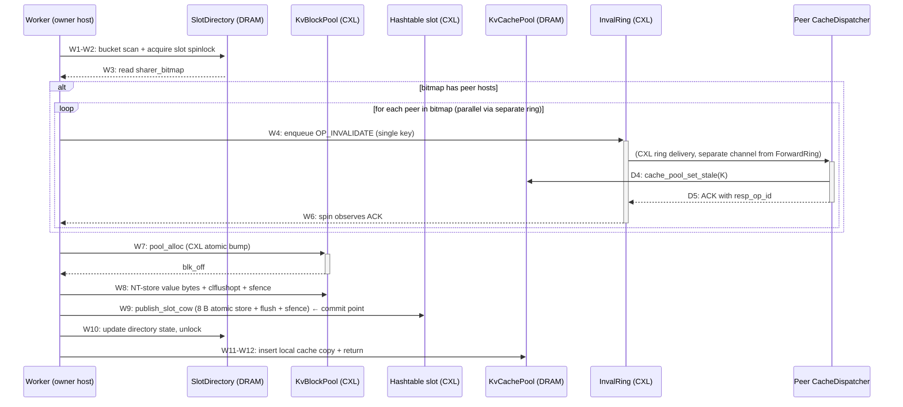

# Protocol A — Architecture Blueprint

> **Living document.** Update at the end of every iter whose code change
> touches the read/write/invalidate/forward path, or any role/data layout.
> The expectation is: anyone reading this doc + the latest iter summary
> understands the system without opening a `.cc` file.
>
> **Sister doc**: `docs/design_goals.md` is the "why" (invariants, RAPs,
> anti-patterns); **this** is the "what + how" (current implementation
> shape).
>
> **Snapshot point**: end of iter-11A (2026-05-11).

This doc has two layers and one cross-cutting reference:
- **Part I — System overview**: plain language, no code.
- **Part II — Per-stage pseudo-code dictionary**: indexed by stage tag
  (W1..W12, R0_tls_hit, R1..R6, I1..I8, F1..F7, D1..D5). When a probe
  trace says "stage W7 p99 = 300 µs", you open Part II §W7 and
  immediately see what W7 does in sub-steps + which CXL/DRAM primitives
  are involved.
- **Part III — Cross-cutting reference**: CXL primitive cost cheat sheet,
  synchronization contracts, known failure modes.

---

# Part I — System Overview

## I.1 Two-tier topology

```
                   shared CXL Type-3 device (/dev/dax0.0, 512 GiB)
                   ┌────────────────────────────────────────────┐
                   │  • Hashtable buckets    (single copy)      │
                   │  • KV blockpool         (segmented per H)  │
                   │  • ForwardRingMatrix    [H][H] SPSC        │
                   │  • InvalRingMatrix      [H][H] SPSC        │
                   └────────────────────────────────────────────┘
                            ↑                    ↑
                   load/store via clflushopt + sfence/mfence
                            ↑                    ↑
            ┌───────────────┴────┐    ┌──────────┴──────────┐
            │                    │    │                     │
            │  host 0 (g3)       │    │  host 1 (g4)        │
            │  per-host DRAM:    │    │  per-host DRAM:     │
            │   • SlotDirectory  │    │   • SlotDirectory   │
            │   • KvCachePool    │    │   • KvCachePool     │
            │   • ShardingTable  │    │   • ShardingTable   │
            │  (MAP_SHARED       │    │  (MAP_SHARED        │
            │   across same-host │    │   across same-host  │
            │   workers)         │    │   workers)          │
            └────────────────────┘    └─────────────────────┘
```

**Two tiers, two roles**:
- **CXL** = the only place a piece of data is *authoritative*. Both hosts
  see the same physical bytes. Writes here are visible cross-host but
  only after `clflushopt + sfence`.
- **DRAM (per host)** = a *cache* of CXL data + the host-local
  *coordination metadata* that no peer host ever needs to read.

H ≤ 8 (hard cap from sharer_bitmap = 8 bits). Currently H = 2 on g3+g4.

## I.2 The roles (per host) — iter-9A redo through iter-11A

Workers are processes; the 6 named system threads live in the host's primary client process.

| # | Role | Count per host | What it owns | CPU | Spawn site |
|---|---|---|---|---|---|
| 1 | **Worker** | T (1..64) | Issues KV ops (`insert/update/remove/search`). Each worker has its own `TlsCache` L1 (iter-10A Phase 1) pointed at via thread-local `g_thread_tls`. | cpu 0..(T-1) (pinned) | Each is a fork-child process of the YCSB driver; primary client (host 0 client 0) is also a worker. |
| 2 | **WriteSender** | 1 | Drains aggregator slots[Write][*]; sole producer on `WriteRing[me][*]`. (Default OFF — workers go direct to the CXL ring; opt in via `FUSEE_USE_AGGREGATOR=1`.) iter-10A Phase 3 added 4 batch policies P0/P1/P2/P3 via `FUSEE_BATCH_POLICY`; **B0 (worker-direct, no aggregator) wins by 20×** so the default stays direct. | cpu 64 (pinned) | spawned in `enable_senders(spawn=true)` |
| 3 | **WriteReceiver** | 1 | Drains incoming `WriteRing[*][me]`. Handles op 1/2/3 (UPDATE/INSERT/DELETE) from peer host workers. Reads value bytes from `ForwardStaging[src][me][slot_idx]` then calls `execute_write_local` (full W1..W12) on behalf of the forwarder. | cpu 65 (pinned) | spawned in `enable_write_ring(spawn=true)` |
| 4 | **ReadSender** | 1 | Drains aggregator slots[Read][*]; sole producer on `ReadRing[me][*]`. (Default OFF, see WriteSender.) | cpu 66 (pinned) | `enable_senders(spawn=true)` |
| 5 | **ReadReceiver** | 1 | Drains incoming `ReadRing[*][me]`. Handles op 4 (CACHE_REGISTER) **forwarder-pool-direct path (iter-11A Phase 1)**: under directory lock sets sharer bit, reads value bytes from local pool, writes them **directly** into `ReadStaging[req_host][me][slot_idx].value_bytes` along with `lookup_epoch` (C13 tag), then publishes `staging.ready_op_id = req_op_id`. Reader polls staging instead of doing a second `pool_->read`. | cpu 67 (pinned) | `enable_read_ring(spawn=true)` |
| 6 | **InvalSender** | 1 | Drains aggregator slots[Inval][*]; sole producer on `InvalRing[me][*]` for worker-originated invalidates. (Default OFF.) | cpu 68 (pinned) | `enable_senders(spawn=true)` |
| 7 | **InvalReceiver** | 1 | Drains incoming `InvalRing[*][me]`. Handles op 5 (INVALIDATE) from peer writers; calls `cache_pool_set_stale(key)` (bumps bucket epoch under seqlock CAS → invalidates same-bucket TLS entries on this host); ACKs. CRUCIALLY does NOT call `execute_write_local` and holds NO directory lock — breaks the iter-4A-redo deadlock cycle. **Single-thread** (iter-11A Phase 2 shipped a `1 dispatcher + 8 workers` design that PASSed hash-diff 20/20 but regressed w_p99 26×; reverted in commit 5664945 — see iter-12A backlog #4 for redesign). | cpu 69 (pinned) | `enable_invalidate(spawn=true)` |
| 8 | (Implicit) primary client process | 1 | Sets up CXL region + DRAM regions pre-fork; owns the 6 background threads above; itself runs as worker. | (its main thread is pinned per row 1) | The first process started per host (`FUSEE_HOST_ID=0/1`, `FUSEE_NUM_THREADS=T` → forks `T-1` children). |

At T=64: each host has **64 worker processes + 6 background threads on primary's process** = 70 schedulable entities. Workers pinned to cpu 0..63, system threads pinned to cpu 64..69, spare cpu 70..85. **All threads CPU-pinned per iter-9A C3** (verified by the `[A:thread]` startup log — see `tests/protocol_a_ycsb.cc`).

**Aggregator routing (Phase 2.C, opt-in)**: when `FUSEE_USE_AGGREGATOR=1`,
workers enqueue ops into per-(ring_kind, worker) DRAM slots and spin on a
local ack — the 3 senders are the sole CXL-ring producers, eliminating
the T-way `fetch_add(tail)` contention. **Default off** because the
single-sender-per-ring design became a new bottleneck at high T even
with iter-10A Phase 3's P1/P2/P3 batch policies (workload-A KV=1024 T=64
cache=on dropped from 9.8 Mops/s direct → 0.5 Mops/s aggregator pre-P*;
P1/P2/P3 narrowed the gap but did not close it — B0 is the production
default and aggregator-path batching is iter-12A backlog #11).

**iter-10A Phase 1.C TLS L1 attach** (per worker, post-fork):
- `set_thread_tls_cache(tls)` stores `tls` in TU-local `g_thread_tls`.
- TLS cache is 1024 entries by default (`FUSEE_TLS_SIZE` env), each
  entry 1088 B (key 8 + observed_epoch 8 + value_size 4 + 1024-B
  inline `value_bytes`, alignas(64) padding) → ~1.1 MiB per worker.
- On TLS hit: compare `entry.observed_epoch` against
  `cache_pool_bucket_epoch(key)`; mismatch → evict TLS slot, fall
  through to shared `cache_pool_lookup`.
- TLS hit/miss is reported by stage tag `R0_tls_hit` / (no tag, falls
  through to `R2hit` / `R2miss`).

## I.3 Data layout cheat sheet

| Region | Tier | Sharing | Purpose | Approx. size |
|---|---|---|---|---|
| **Hashtable** | CXL | one copy | Authoritative key→slot map. B buckets × S=7 slots × 16 B/slot. iter-9A: slot.value encodes a pool `blk_off` (size class + 8-bit fingerprint + offset bits packed via `cxl_slot_pack`); pool block starts with a 4-B `value_len` header followed by value bytes. | `B × S × 16 B` (8 MB at B=65536) |
| **KV blockpool** | CXL | partitioned: H segments, each owned by one host | Value bytes prefixed by 4-B `value_len` header. Single size class per pool (256 / 512 / 1024 B). Within a host's segment only that host's workers allocate via `pool_->alloc()` (`bump.fetch_add(1)` on a CXL cursor — AP16 hazard: no `flush_line` after the RMW, see III.3). | workload-dependent (~512 MB/host at MAX_OPS=200k KV=1024) |
| **WriteRingMatrix** | CXL | per ordered pair: SPSC | iter-9A redo Phase 2.A — carries op 1/2/3 (UPDATE/INSERT/DELETE) only. `[H][H]` rings, depth 256 each, **128-B entry** (req on cl 1, resp on cl 2; tail and head on SEPARATE cachelines per iter-9A redo Phase 2 fix). C2-compliant: NO value bytes inline, just `(key, op_kind, value_len, staging_off, staging_gen)`. | `~H² × 256 × 128 B` |
| **ReadRingMatrix** | CXL | per ordered pair: SPSC | iter-9A redo Phase 2.A — carries op 4 (CACHE_REGISTER) only. Same 128-B 2-cacheline layout as WriteRing. Req `(key)`. **iter-11A Phase 1**: the ring response is just a slot-free signal; the actual value bytes ride on `ReadStagingMatrix` (next row) — reader no longer does a second `pool_->read`. | `~H² × 256 × 128 B` |
| **ForwardStagingMatrix** | CXL | per (src_host, dst_host, slot_idx) | iter-9A redo Phase 2.B — value-bytes arena for op 1/2 (writes). Slot 1:1 with WriteRing slots (same `slot_idx`); each slot holds up to `kForwardStagingSlotBytes` (1024 B) value bytes. Lifetime tracked by ring slot reuse — no separate allocator. | `~H² × 256 × 1024 B` (~4 MiB) |
| **ReadStagingMatrix** | CXL | per (req_host, owner_host, slot_idx) | **iter-11A Phase 1** — owner-forwarder→reader value-bytes arena for op 4 (CACHE_REGISTER) responses. `ReadStagingSlot` = 1 control cacheline {`atomic<uint64_t> ready_op_id`, `lookup_epoch`, `key`, `value_size`, `status`, _pad} + 1024-B `value_bytes`. Owner's `read_handler` writes value bytes + `lookup_epoch` (C13 tag) here directly, then publishes `ready_op_id = req_op_id`; reader polls `ready_op_id`. Eliminates the iter-10A second `pool_->read` roundtrip. | `~4.4 MiB` (`H² × 256 × 1088 B` at H=4) |
| **InvalRingMatrix** | CXL | per ordered pair: SPSC | Carries `OP_INVALIDATE` only (separate from Write/Read rings — see I.7 deadlock argument). `[H][H]` rings, depth 256 each, **128-B entry** (2-cacheline split, head/tail on separate cachelines per iter-9A redo Phase 2 fix). | `~H² × 256 × 128 B` |
| **AggregatorRegion** | DRAM | `MAP_SHARED` across same-host workers | iter-9A redo Phase 2.C — per-(ring_kind, worker) DRAM slots + value buffers. Used only when `FUSEE_USE_AGGREGATOR=1`. | ~204 KiB (DRAM) |
| **SlotDirectory** | DRAM | `MAP_SHARED` across same-host workers | Per-(bucket, slot) coherence state: `sharer_bitmap` (8-bit, one per host), `state` (SHARED / INVALID / …), host-local `pthread_spinlock`, `version` (bumped on every commit). | `B × S × 16 B` |
| **KvCachePool (L2)** | DRAM | `MAP_SHARED` across same-host workers | Open-addressed bucket array. `KvCacheBucket` = host-local spinlock (legacy, unused after iter-10A Phase 2) + **`std::atomic<uint64_t> epoch`** (iter-10A Phase 1.B — bumped on insert/evict/set_stale; TLS readers compare against this) + 4 `KvCacheEntry` slots. Each entry has `std::atomic<uint32_t> seq` (**iter-10A Phase 2 seqlock CAS**: even = stable, odd = mid-update; CAS even→odd to claim, store back even+1 to publish; readers re-load seq after value copy and treat mismatch as miss-retry). | ~8 MB (1024 entry default) |
| **TlsCache (L1)** | DRAM | per-worker private | **iter-10A Phase 1.A** — `kTlsValueMaxBytes=1024` per entry, open-addressed with linear probe (`kTlsProbeMax=8`). Each entry stores `(key, observed_epoch, value_size, value_bytes[1024])` = 1088 B. On TLS hit, reader reloads `cache_pool_bucket_epoch(key)` and compares; mismatch = stale, evict + fall through. **0 cross-core MESI traffic on hit.** | ~1.1 MiB per worker (1024 entries × 1088 B); at T=64 → ~70 MiB/host |
| **ShardingTable** | DRAM | read-only after init | Static `σ: K → H` mapping (`hash(K) >> 31) & (H-1)` currently). | trivial |

## I.4 Read path (overview)

iter-10A introduced an L1 (per-worker TLS) above the shared L2 cache_pool;
iter-11A Phase 1 replaced the cross-host miss path's req→ack→pool_read
with **forwarder-pool-direct** (owner writes value bytes straight into a
CXL staging slot the reader polls).

Six logical outcomes:
1. **TLS L1 HIT, epoch fresh** → 0 cross-core MESI traffic; ~50-300 ns
2. **TLS L1 HIT, epoch stale** → evict TLS entry, fall through to L2
3. **L2 cache_pool HIT, not stale** → seqlock read of shared bucket; populate L1 + return
4. **L2 MISS, owner == self** → scan local CXL bucket array directly + pool read
5. **L2 MISS, owner == peer host** → send `OP_CACHE_REGISTER` via ReadRing; owner forwarder writes value bytes directly into `ReadStagingMatrix`; reader polls staging
6. **Key not found** → return -1

Stage tags (R0_tls_hit, R1..R6):

```mermaid
sequenceDiagram
  participant W as Worker (caller)
  participant TLS as TlsCache L1 (DRAM private)
  participant L2 as KvCachePool L2 (DRAM shared)
  participant CXL as CXL bucket+pool
  participant RR as ReadRing (CXL)
  participant RS as ReadStaging (CXL)
  participant RECV as Peer ReadReceiver
  W->>+TLS: R1: enter search(K)
  TLS-->>W: epoch compare
  alt TLS hit + epoch fresh
    W->>W: R0_tls_hit: return value (~50-300 ns)
  else TLS miss / stale → L2
    W->>+L2: cache_pool_lookup (seqlock CAS read)
    L2-->>-W: R2hit / R2miss
    alt L2 hit
      W->>TLS: populate L1 with current epoch
      W->>W: R6: return (≈ 5-15 µs depending on KV size memcpy)
    else cross-host miss
      W->>+RR: R3: enqueue OP_CACHE_REGISTER; clear staging.ready_op_id; capture my_epoch_at_send
      RR->>+RECV: (CXL ring delivery)
      RECV->>RECV: scan bucket; set sharer bit (under dir lock)
      RECV->>RS: write value_bytes + lookup_epoch (C13) + status; publish ready_op_id = req_op_id
      W->>RS: poll ready_op_id == req_op_id (200 ms timeout)
      RS-->>-W: R4: validate lookup_epoch >= my_epoch_at_send; memcpy value_bytes
      RR-->>-W: (ring slot freed by reader, not by recv)
      W->>L2: cache_pool_insert (§AP15: only after ACK)
      W->>TLS: populate L1 with new epoch
      W->>W: R6: return (≈ 3-8 µs total, ~30 % faster than iter-10A's req-then-pool path)
    else owner-self miss
      W->>+CXL: R5: bucket flush+scan; pool->read header (4 B) then bytes (value_len)
      CXL-->>-W: value
      W->>L2: cache_pool_insert; W->>TLS: populate L1
      W->>W: R6: return (≈ 8 µs total)
    end
  end
```

**iter-11A Phase 1 §I9 / C13 invariant**: the staging slot's
`lookup_epoch` is the bucket epoch at the owner forwarder's
`cache_pool_lookup` time. Reader compares against the bucket epoch it
observed BEFORE sending the request (`my_epoch_at_send`). If
`staging.lookup_epoch < my_epoch_at_send`, the owner's view was
older than the reader's local cache snapshot at send time → reader
returns `-3` (stale-snapshot) and the caller retries (re-reads
cache_pool, which now sees the fresh entry). Without this check the
reader could install a stale value into TLS/L2 before a concurrent
writer's invalidate reaches this host → strict-A violated.

## I.5 Write path (overview)

Two flavors:
- **owner == self**: full local CoW path (W1..W12)
- **owner == peer**: enqueue `OP_WRITE_FORWARD`, peer's ForwardResponder runs full owner-side path on our behalf (becomes their W1..W12)

For owner-self, the protocol must invalidate any peer host that has the slot's key cached, BEFORE the new value becomes visible. That's Step 4 (W3..W6 in stage tags). The writer broadcasts `OP_INVALIDATE` to every host bit set in `sharer_bitmap` and waits for each ACK before publishing the new slot pointer.



**The commit point** (when the new value becomes visible to peer hosts) is **W9** (the slot pointer flush). Steps W10-W12 are owner-local bookkeeping. By the time W9 fires, all peer caches must already be marked stale (W6 ACK received) — that's how strict-A linearizability (§I9) is preserved.

**iter-10A Phase 1.C TLS coherence on write**: after `cache_pool_insert`
in W11 bumps the bucket epoch, this thread immediately calls
`tls_insert(g_thread_tls, key, value, value_len, new_epoch)` so its
own subsequent read hits TLS with the freshest epoch. On DELETE,
`tls_evict(g_thread_tls, key)` runs (belt + suspenders — the bucket
epoch bump from `cache_pool_evict` would already invalidate any
TLS entry on next read of any key in that bucket).

**iter-10A Phase 2 seqlock CAS on cache_pool**: W11's
`cache_pool_insert` no longer takes the legacy per-bucket spinlock.
Inserter CAS-claims the target entry's `seq` (even → odd), writes
`(key, stale=0, value_size, value_bytes)`, then stores `seq = even+1`
(release). Readers loop "load seq → memcpy fields → re-load seq"
and on mismatch retry up to 8 times. Net effect: writer can complete
without blocking concurrent same-bucket readers (they retry).

## I.6 The four cross-host messages

| Op | From | To | Channel | Carries |
|---|---|---|---|---|
| `OP_WRITE_FORWARD` | non-owner Worker | owner ForwardResponder | ForwardRing | `(op_kind, key, value u64)` (currently inline u64; for KV ≥ 256 B real impl uses ForwardStaging area, see I.3) |
| `OP_CACHE_REGISTER` | reader Worker | owner ForwardResponder | ForwardRing | `(key)` request; response carries `value` |
| `OP_INVALIDATE` | writer Worker | sharer CacheDispatcher | **InvalRing** (separate from ForwardRing) | `(key)` only |
| `OP_RESPONSE` | ForwardResponder / CacheDispatcher | original requester | back-channel of same SPSC slot (`resp_op_id` field) | `(status, [optional value])` |

## I.7a Cache hierarchy snapshot (iter-11A)

```
┌──────────────────────────────────────────────────────────────┐
│ Worker thread (CPU 0..T-1)                                   │
│  ├─ L1: TlsCache (DRAM private)         ~1.1 MiB / worker    │
│  │   key, observed_epoch, value_bytes                        │
│  │   epoch-validated against L2 bucket_epoch                 │
│  └─ ↓ on miss / stale                                        │
└─────────────┬────────────────────────────────────────────────┘
              │
┌─────────────▼────────────────────────────────────────────────┐
│ KvCachePool (DRAM MAP_SHARED across same-host workers)       │
│   per-bucket: 4 entries + 8-B `epoch` atomic                 │
│   per-entry:  seqlock seq (CAS even→odd→even) + value bytes  │
│   stale flag: lazy invalidation by InvalReceiver             │
└─────────────┬────────────────────────────────────────────────┘
              │ ↓ on miss
┌─────────────▼────────────────────────────────────────────────┐
│ CXL: hashtable + per-host blockpool                          │
│   slot.value = packed(blk_off, size_class, fingerprint)      │
│   pool block = 4-B value_len header + value bytes            │
└──────────────────────────────────────────────────────────────┘
```

For cross-host reads (owner != self):
- Reader's `my_epoch_at_send` = `cache_pool_bucket_epoch(key)` at send
  time (captured immediately before `ring->tail.fetch_add`).
- Owner forwarder's `lookup_epoch` = `cache_pool_bucket_epoch(key)` at
  read-handler dispatch time.
- Reader rejects responses with `lookup_epoch < my_epoch_at_send`
  (C13 invariant) → return `-3`, caller retries.

## I.7 Key design choices (one-liner each)

| Choice | One-line rationale |
|---|---|
| **Sharding** keys to a single owner host | eliminates cross-host writer mutex (no global atomic CAS needed) |
| **Hashtable on CXL, single copy** | no replica consistency problem; sharding makes the owner the sole writer |
| **Blockpool on CXL, per-host segment** | no cross-host alloc contention; each host bumps its own cursor |
| **SlotDirectory in DRAM, not CXL** | hot + owner-local; DRAM coherence ~50 ns vs CXL flush ~600 ns each mutation |
| **KvCachePool MAP_SHARED across same-host workers** | sharer-set tracked at host granularity (8-bit bitmap), not per-worker |
| **Separate InvalRing channel** (vs reusing ForwardRing) | breaks deadlock cycle: ForwardResponder running `execute_write_local` could need to send invalidate; if both messages share one channel + one consumer thread, circular wait → deadlock. CacheDispatcher consumes InvalRing independently. |
| **CoW value publish via slot-pointer atomic store** | 8-byte naturally aligned store is atomic on x86; no read-side lock needed |
| **Lazy stale flag in cache** (not physical eviction on invalidate) | dispatcher work per inval = 1-byte store + ACK; cheap enough to keep dispatcher's roundtrip short |
| **SPSC rings (per src→dst pair)** | no atomic contention on `tail.fetch_add` (single producer); consumer is single dispatcher/responder |
| **Per-slot directory (not per-bucket)** | avoids 7× false sharing on hot bucket |
| **`req_op_id` and `resp_op_id` on separate cachelines (iter-6A)** | producer-only writes line 1, consumer-only writes line 2; no cacheline ping-pong over CXL |

---

# Part II — Per-Stage Pseudo-Code Dictionary

### iter-9A redo terminology mapping (Part II §II.3-II.6 readers)

The stage tags (W*, R*, I*, F*, D*) below are the same as iter-5A. The
**ring/thread names** mentioned in narrative text changed in iter-9A
redo Phase 2; treat the following s/replace as canonical when reading
older sections of this document:

| Pre-iter-9A name           | iter-9A redo name (this document going forward)         |
|----------------------------|---------------------------------------------------------|
| `ForwardRing` / `ForwardRingMatrix` | `WriteRing`/`WriteRingMatrix` (op 1/2/3) AND `ReadRing`/`ReadRingMatrix` (op 4) — see I.3 |
| `ForwardResponder` (thread) | `WriteReceiver` (cpu 65) AND `ReadReceiver` (cpu 67)     |
| `CacheDispatcher` (thread)  | `InvalReceiver` (cpu 69)                                 |
| (none)                       | `WriteSender` (cpu 64), `ReadSender` (cpu 66), `InvalSender` (cpu 68) — opt-in via `FUSEE_USE_AGGREGATOR=1` |
| `ForwardEntry::payload[1024]` (inline) | `ForwardStaging[src][dst][slot_idx].bytes[1024]` (separate CXL arena, C2-compliant) |
| `enable_forward(fr)`         | `enable_write_ring(wr, fs) + enable_read_ring(rr)`       |
| `enable_invalidate(ir)`      | `enable_invalidate(ir)` (unchanged) + `enable_senders(ar)` |
| `forward_to_owner()`         | `forward_write_direct()` (called from worker dispatcher `forward_write()`) |
| `forward_cache_register()`   | `forward_read_direct()` (called from worker dispatcher `forward_read()`) |
| `responder_loop()`           | `write_receiver_loop()` + `read_receiver_loop()`        |
| `cache_dispatcher_loop()`    | `inval_receiver_loop()`                                  |

The §II.3-II.6 narrative text below was written pre-iter-9A and still
uses the pre-rename names in places. Apply the table above mentally —
the per-stage Expected/Healthy timings remain valid (path_decomp on the
post-Phase-2 architecture confirms 0.3–1.6× H/E ratios on every stage
except W10 which has been carried at 4× since iter-9A original).

## II.0 Notation

**Primitive abbreviations**:

| Abbrev | Meaning | Cost (healthy, single op) |
|---|---|---|
| `LD-DRAM` | local DRAM load (cached) | ~1-5 ns |
| `LD-DRAM-cold` | local DRAM load (cold cacheline, owner just modified) | ~50-200 ns |
| `ST-DRAM` | local DRAM store | ~1-5 ns |
| `LD-CXL` | CXL coherent load (after `clflushopt + mfence`) | ~600 ns |
| `ST-CXL` | CXL store (then needs `clflushopt + sfence` to be peer-visible) | ~5-10 ns to commit locally; +600 ns flush |
| `FLUSH` | `clflushopt(addr)` (writes back if dirty + invalidates from local cache) | ~50 ns issue, ~600 ns to complete via fence |
| `MFENCE` / `SFENCE` / `LFENCE` | memory barriers | ~10 ns |
| `LOCK-acq` | `pthread_spin_lock` uncontested | ~50 ns |
| `LOCK-acq-cont` | spinlock contended | ~50 ns - ∞ (depends on holders queued) |
| `RMW-CXL` | atomic RMW on CXL address (e.g., `bump.fetch_add`) | ~200 ns + flush_line if cross-host visibility wanted (AP16) |

**Healthy baseline** in each stage means: typical cost summed from primitives, assuming uncontested locks + no preemption + no CXL transient. iter-N+ probes compare to this.

**Sync contract** notation: `requires:` = invariant assumed at entry; `provides:` = invariant established at exit.

---

## II.1 Worker write path (W1..W12)

Source: `src/cxl_kv_ops_A.cc :: execute_write_local()`.

### W1 — Entry to `execute_write_local`

**Sub-steps**:
- W1.1: receive `(key, new_value, op_kind)` from caller (`insert/update/remove`)
- W1.2: compute `b = bucket_idx(key) = fnv1a_u64(key) % num_buckets`
- W1.3: compute `bucket = &buckets_[b]` (pointer arithmetic in CXL region)

**Pseudo-code**:
```
W1: enter execute_write_local(key, new_value, op_kind):
  if key == EMPTY: return -1
  PROBE("W1", key)
  b = fnv1a_u64(key) % num_buckets   // ~10 ns local
  bucket = &buckets_[b]               // ptr arith
```

**Primitives**: 1× FNV-1a hash on local register, 0 memory ops.
**Healthy baseline**: ~15 ns CPU.
**Sync contract**: requires nothing; provides `bucket` pointer.

→ `src/cxl_kv_ops_A.cc:127-132`

### W2 — Bucket scan + acquire slot directory spinlock

**Sub-steps**:
- W2.1: `flush_line(bucket); flush_line(bucket+64); full_fence()` (force CXL refetch of both bucket cachelines)
- W2.2: scan 7 slots looking for matching key OR first empty
- W2.3: decide `target_slot` based on op_kind (insert needs empty, update/delete need matching)
- W2.4: get `de = slot_directory_entry(dir_, b, target_slot)` (DRAM pointer)
- W2.5: `slot_directory_lock(de)` — `pthread_spinlock` on host-local DRAM

**Pseudo-code**:
```
W2: bucket scan + lock:
  FLUSH(bucket); FLUSH(bucket+64); MFENCE
  match = -1; empty = -1
  for s in 0..6:
    if bucket->slots[s].key == key: match=s; break
    if bucket->slots[s].key == EMPTY and empty<0: empty=s
  target_slot = pick(match, empty, op_kind)   // returns -1/-2/-3 if invalid
  de = slot_directory_entry(dir_, b, target_slot)
  LOCK-acq(de->spinlock)
  PROBE("W2", key)
```

**Primitives**: 2× FLUSH, 1× MFENCE, 7× LD-CXL (slot keys), 1× LOCK-acq.
**Healthy baseline**: 2×600 + 10 + 7×600 + 50 = **~5.5 µs uncontested**. p99 6-50 µs from spinlock contention on hot Zipf keys.
**Sync contract**: provides exclusive ownership of (bucket, target_slot).

→ `src/cxl_kv_ops_A.cc:133-157`

### W3 — Read sharer_bitmap (decision: invalidate any peers?)

**Sub-steps**:
- W3.1: `flush_line(bucket); full_fence()` (re-flush since lock acquire was a long sync point)
- W3.2: `slot = &bucket->slots[target_slot]`
- W3.3: `bitmap = de->sharer_bitmap` (DRAM read, hot cacheline since we just locked it)

**Pseudo-code**:
```
W3: re-verify under lock:
  FLUSH(bucket); MFENCE
  slot = &bucket->slots[target_slot]
  bitmap = de->sharer_bitmap         // LD-DRAM (own cache)
  PROBE("W3", key)
```

**Primitives**: 1× FLUSH, 1× MFENCE, 1× LD-DRAM.
**Healthy baseline**: ~610 ns.

→ `src/cxl_kv_ops_A.cc:158-174`

### W4 — Begin invalidate broadcast (if any peer sharers)

**Sub-steps**:
- W4.1: `if op_kind == INSERT`: skip (no prior sharers possible) → jump to W7
- W4.2: `if num_hosts_ <= 1 || ir_ == nullptr`: skip → jump to W7
- W4.3: enter loop over hosts h ∈ [0, H), skip self and skip hosts with `bitmap & (1<<h) == 0`

**Pseudo-code**:
```
W4: enter broadcast loop:
  if op_kind == INSERT or H <= 1 or ir_ == NULL: goto W7
  n_sent = 0
  for h in 0..H-1:
    if h == self: continue
    if (bitmap & (1<<h)) == 0: continue
    if n_sent == 0: PROBE("W4", key)
    // call into send_invalidate (I1..I8 stages)
    send_invalidate(h, key)            // BLOCKING — waits for ACK or 5 ms timeout
    n_sent++
  if n_sent > 0: PROBE("W6", key)
```

**Primitives**: branch + loop bookkeeping.
**Healthy baseline**: <100 ns (loop overhead). The actual cost is in the I1..I8 sub-stages of `send_invalidate`, which run synchronously from this loop.

→ `src/cxl_kv_ops_A.cc:175-187`

### W5..W6 — Wait for invalidate ACKs (loop body cost)

W5 is reserved for "first send_invalidate ACK seen" (currently NOT emitted by the code — known gap, fix in iter-8A probe upgrade per Sol-1).

W6 = "last send_invalidate ACK seen" = end of broadcast loop.

**The actual work happens inside `send_invalidate` (Part II.4 below, stages I1..I8)**. Per peer, expected roundtrip ~5 µs healthy, capped at 5 ms timeout.

**At H=2**: the loop body runs at most once (1 peer to invalidate); W4→W6 ≈ 1 × send_invalidate cost.

### W7 — Pool alloc (CoW prep)

**Sub-steps**:
- W7.1: `if op_kind == DELETE: retire_slot(slot)` (clear key, no alloc) → jump to W10
- W7.2: `if pool_ == nullptr: publish_slot_cow(slot, key, new_value)` (legacy inline u64 path) → jump to W9
- W7.3: `blk_off = pool_->alloc()` — `cursors_[host_id_].bump.fetch_add(1)` on CXL
- W7.4: if blk_off == 0 (exhausted): unlock + return -4

**Pseudo-code**:
```
W7: alloc value block:
  if op_kind == DELETE:
    retire_slot(slot)               // 8-B key clear + FLUSH + SFENCE
    PROBE("W9", key); goto W10
  if pool_ == NULL:
    publish_slot_cow(slot, key, new_value)   // legacy inline u64
    PROBE("W9", key); goto W10
  blk_off = pool_->alloc()          // RMW-CXL bump cursor (NO flush_line — AP16 hazard)
  PROBE("W7", key)
  if blk_off == 0:
    UNLOCK(de); return -4
```

**Primitives**: 1× RMW-CXL (`fetch_add` on CXL bump cursor).
**Healthy baseline**: ~200 ns (atomic RMW on uncontended cacheline).
**Known issue (AP16)**: pool's `bump.fetch_add` lacks following `flush_line + sfence`. OK for same-host re-read, but cross-host visibility of bump cursor is broken. Currently no peer reads cursor so no observed bug. iter-8A defensive fix.

→ `src/cxl_kv_ops_A.cc:188-211`

### W8 — Pool write (NT-store value bytes)

**Sub-steps**:
- W8.1: `pool_->write(blk_off, &new_value, sizeof(new_value))` — calls `memcpy` + per-cacheline `clflushopt` + final `sfence`
- W8.2: For 8 B u64 inline: 1 cacheline. For KV=256: 4 cachelines. For KV=1024: 16 cachelines.

**Pseudo-code**:
```
W8: write value to CXL pool:
  pool_->write(blk_off, &new_value, sizeof(new_value)):
    memcpy(base+blk_off, &new_value, sizeof)
    for each cacheline touched:
      FLUSH(cacheline)
    SFENCE
  PROBE("W8", key)
```

**Primitives**: 1× ST-DRAM (memcpy hits write-combining buffer), N× FLUSH where N = ceil(value_size / 64), 1× SFENCE.
**Healthy baseline**: 8 B inline = 1×600 ns ≈ 0.6 µs. KV=256 = 4×600 ns ≈ 2.4 µs. KV=1024 = 16×600 ns ≈ 10 µs.

→ `src/cxl_kv_blockpool.cc::write`

### W9 — Publish slot CoW (the commit point)

**Sub-steps**:
- W9.1: encode `encoded = pack(blk_off, size_class, fp)` — local arithmetic
- W9.2: `slot->value = encoded` (8 B store, naturally aligned, atomic on x86)
- W9.3: `flush_line(slot); sfence`
- W9.4: `slot->key = key` (publish key second; readers gate on key)
- W9.5: `flush_line(slot); sfence`

**Pseudo-code**:
```
W9: publish_slot_cow:
  encoded = pack(blk_off, sc=BLOCK256, fp=fnv1a(key)&0xFF)
  slot->value = encoded            // ST-CXL atomic 8B
  FLUSH(slot); SFENCE
  slot->key = key                  // ST-CXL atomic 8B (publish gate)
  FLUSH(slot); SFENCE
  PROBE("W9", key)
```

**Primitives**: 2× ST-CXL, 2× FLUSH, 2× SFENCE.
**Healthy baseline**: ~1.2 µs.
**Sync contract**: this is the §I10 commit point. After SFENCE on W9.5 returns, peer hosts that load `slot->key` (with their own flush+mfence) will see the new key, AND if they then load `slot->value` they see the new value.

→ `src/cxl_kv_ops_A.cc::publish_slot_cow`

### W10 — Directory state update (post-commit bookkeeping)

**Sub-steps**:
- W10.1: `de->version++`
- W10.2: if DELETE: `de->state = INVALID; de->sharer_bitmap = 0`
- W10.3: else: `de->state = SHARED; de->sharer_bitmap = (1 << host_id_)` (reset to "self only"; peer must re-register if it wants to re-cache)

**Pseudo-code**:
```
W10: directory state:
  de->version++                    // ST-DRAM
  de->state = SHARED                // ST-DRAM
  de->sharer_bitmap = 1 << self     // ST-DRAM
  PROBE("W10", key)
  UNLOCK(de->spinlock)
```

**Primitives**: 3× ST-DRAM, 1× LOCK-rel.
**Healthy baseline**: ~50 ns.

→ `src/cxl_kv_ops_A.cc:223-246`

### W11 — Local cache update

**Sub-steps**:
- W11.1: if DELETE: `cache_pool_evict(cache_, key)`
- W11.2: else: `cache_pool_insert(cache_, key, &new_value, 8)` — DRAM hashmap insert

**Pseudo-code**:
```
W11: local cache update:
  if DELETE: cache_pool_evict(cache_, key)
  else:      cache_pool_insert(cache_, key, &new_value, 8)
```

**Primitives**: 1 hashmap op on `MAP_SHARED` DRAM region. May involve internal spinlock per cache bucket.
**Healthy baseline**: ~3 µs (DRAM hashmap with per-bucket spinlock).

→ `src/cxl_cache_pool.cc::cache_pool_insert`

### W12 — Return

**Sub-steps**:
- W12.1: `PROBE("W12", key); return 0`

**Healthy baseline total** (W1→W12 owner-self UPDATE, KV=8, no peer sharers): ~5 µs typical, ~30 µs p99. With invalidate broadcast (W4-W6 fires): +5 µs typical, +5 ms tail (timeout cap).

---

## II.2 Worker read path (R0_tls_hit, R1..R6)

Source: `src/cxl_kv_ops_A.cc :: search()`.

### R1 — Entry to search

```
R1: enter search(key, *out_buf, *out_len):
  if key == EMPTY: return -1
  PROBE("R1", key)
```

### R0_tls_hit — TLS L1 fast path (iter-10A Phase 1.C)

```
R0: TLS L1 lookup:
  if g_thread_tls is set:
    cur_epoch = cache_pool_bucket_epoch(cache_, key)   // 1 LD on shared bucket
    if tls_lookup(g_thread_tls, key, cur_epoch, buf, &sz):
      PROBE("R0_tls_hit", key)
      copy buf to out_buf (up to buf_len)
      PROBE("R6", key); return 0
```

**Healthy baseline**: ~50-300 ns (bucket epoch load + linear probe ≤ 8
slots in private DRAM + value memcpy from L1/L2 cache). The bucket
epoch is on the cache_pool's shared cacheline so the load is one
MESI fetch (worst case ~100 ns); on hit no other shared cacheline is
touched.

→ `src/cxl_kv_ops_A.cc:1704-1717`

### R2 — Shared L2 cache_pool lookup (with stale + seqlock check)

```
R2: cache_pool_lookup (iter-10A Phase 2 seqlock CAS reader):
  for retry in 0..7:
    seq0 = entry->seq.load()        // even = stable
    if seq0 is odd: pause; continue
    key0 = entry->key
    stale = entry->stale
    sz = entry->value_size
    memcpy(buf, entry->value_bytes, sz)
    seq1 = entry->seq.load()
    if seq0 == seq1 and key0 == key and !stale: return HIT
  return MISS
  if HIT:
    PROBE("R2hit", key); populate TLS L1; PROBE("R6", key); return 0
  PROBE("R2miss", key)
```

`cache_pool_lookup` returns false if entry not present, stale flag set, or seqlock retry budget exhausted.

**Healthy baseline**: ~300-500 ns hit (seqlock read), ~500 ns miss.
**Hot-bucket p99**: 5-15 µs (Phase 5 path_decomp on workload-a T=64
cache=on shows R1+R2 dominated by the 1024-B `value_bytes` memcpy
MESI ping-pong — this is the gap TlsCache closes).

→ `src/cxl_cache_pool.cc::cache_pool_lookup`

### R3 — (cross-host miss only) Send OP_CACHE_REGISTER + capture epoch

```
R3: forward_read_direct(owner, key) (iter-11A Phase 1):
  owner = host_of(key)
  if owner == self: goto R5
  PROBE("R3", key)
  ring = &rr_->rings[self][owner]
  op_id = encode(self, ++read_op_counter)
  tpos = ring->tail.fetch_add(1)   // RMW-CXL
  flush(&ring->tail); sfence
  e = &ring->entries[tpos % depth]
  while e->req_op_id != 0: pause   // wait-for-slot-free
  my_epoch_at_send = cache_pool_bucket_epoch(cache_, key)   // C13
  st = read_staging_slot(rs_, self, owner, slot_idx)
  st->ready_op_id = 0; flush; sfence   // clear prior signal
  e->key = key; e->req_op_id = op_id; flush; sfence
```

**Primitives**: 1× RMW-CXL on tail, 1× LD-DRAM (`bucket_epoch`), 1× ST-CXL on staging.ready_op_id, 1× ST-CXL on entry. Probes emitted at the start (`R3`).

### R4 — Poll ReadStaging + C13 validate + memcpy

```
R4: spin on staging (200 ms timeout):
  PROBE("R4", key)
  t0 = now_ns_mono()
  for (;;):
    flush(&st->ready_op_id); mfence
    if st->ready_op_id == op_id: break
    if now_ns - t0 > 200 ms: timed_out = true; break
    pause
  e->req_op_id = 0; flush; sfence   // CRITICAL — free ring slot
  if timed_out: return -2

  flush(st); mfence
  if st->lookup_epoch < my_epoch_at_send:   // C13 reject
    return -3   // caller retries from R2
  if st->status != 0: return st->status
  vlen = st->value_size
  for off in 0..vlen step 64: flush(value_bytes + off)
  mfence
  memcpy(out_buf, st->value_bytes, min(vlen, buf_len))
  cache_pool_insert(cache_, key, v, vlen)   // §AP15 — only after ready
  if g_thread_tls: tls_insert(key, v, vlen, current_bucket_epoch)
  PROBE("R6", key); return 0
```

**Primitives per spin**: 1× flush + 1× mfence + 1× LD-CXL on staging.ready_op_id (1 cacheline). After ready: 1× flush on each value cacheline + 1 mfence + memcpy.
**Healthy baseline (R3+R4 combined)**: ~3-5 µs (one CXL roundtrip for the ring tail + one for the staging poll + value-byte read; no second `pool->read`).
**Per `§AP15`**: cache insert AND TLS insert must NOT happen before `ready_op_id` is observed AND `lookup_epoch >= my_epoch_at_send` (the C13 reject path keeps L1/L2 from caching values older than the reader's view).

→ `src/cxl_kv_ops_A.cc:1378-1487` (`forward_read_direct`)
→ `src/cxl_kv_ops_A.cc:1522-1619` (`read_handler` — peer side)

### R5 — (owner-self miss only) Direct CXL bucket scan + pool fetch

```
R5: owner-self miss:
  bucket = &buckets_[bucket_idx(key)]
  flush(bucket); flush(bucket+64); mfence
  for s in 0..6:
    if bucket->slots[s].key == key:
      encoded = bucket->slots[s].value
      sc = cxl_slot_size_class(encoded)
      if sc == INLINE or pool_ == NULL:
        v = encoded; vlen = 8
      else:
        blk_off = cxl_slot_blk_off(encoded)
        pool_->read(blk_off, hdr, 4)        // 4-B header = value_len
        memcpy(&vlen, hdr, 4)
        pool_->read(blk_off + 4, v, vlen)   // FLUSH + LD-CXL per cacheline
      memcpy(out_buf, v, min(vlen, buf_len))
      cache_pool_insert(cache_, key, v, vlen)
      if g_thread_tls: tls_insert(key, v, vlen, current_bucket_epoch)
      PROBE("R6", key); return 0
  return -1   // not found
```

**Healthy baseline (R5 path, miss)**: ~5-10 µs (bucket flush + scan + pool header read + pool value read + L2 + L1 populate). Scales with KV size: at KV=1024 the pool->read is 16 cachelines = ~10 µs of LD-CXL.

### R6 — Return

`PROBE("R6"); return 0` — uniform exit point regardless of which sub-path was taken.

→ `src/cxl_kv_ops_A.cc:1694-1806`

---

## II.3 Send invalidate (producer side, called from W4-W6)

Stages I1..I8. Source: `src/cxl_kv_ops_A.cc :: send_invalidate()`.

### I1 — Reserve InvalRing slot

```
I1: reserve slot:
  ring = &ir_->rings[self][target_host]
  my_op = inval_op_counter_++ + 1                       // local atomic
  op_id = (host_id+1) << 56 | my_op                     // pack
  tpos = ring->tail.fetch_add(1, ACQ_REL)               // RMW-CXL on tail
  FLUSH(&ring->tail); SFENCE                            // make new tail visible to consumer
  PROBE("I1", op_id)
```

**Primitives**: 1× RMW-CXL on tail, 1× FLUSH, 1× SFENCE.
**Healthy baseline**: ~700 ns.

### I2 — Wait for slot free + write entry

```
I2: write entry:
  slot_idx = tpos % 256
  e = &ring->entries[slot_idx]
  // wait-for-slot-free: previous occupant must be done (req_op_id == 0)
  loop:
    FLUSH(e); MFENCE
    if e->req_op_id == 0: break
    pause()                                              // <-- NO TIMEOUT (known issue!)
  e->key = key
  e->resp_op_id.store(0, RELAXED)                       // pre-clear resp
  e->status = 0
  ATOMIC_THREAD_FENCE(RELEASE)
  e->req_op_id.store(op_id, RELEASE)                    // ST-CXL on line 1
  FLUSH(e); SFENCE                                      // push line 1 to CXL
  PROBE("I2", op_id)
```

**Primitives**: 1× FLUSH (+ MFENCE) per spin iter for waiting; then 4× ST-DRAM-then-flush, 1× FLUSH on entry line 1, 1× SFENCE.
**Healthy baseline**: ~1.5 µs typical (no wait). When wait-for-slot-free fires, **no upper bound** — known cascade trigger (iter-7A diagnosis).

### I3 — (consumer side) Dispatcher sees new tail

(See II.5 D2 below — consumer-side stage I3 emitted by `cache_dispatcher_loop` when it drains.)

### I4 — (consumer side) Dispatcher loads entry

(See II.5 D3 below.)

### I5 — (consumer side) Dispatcher calls cache_pool_set_stale

(See II.5 D4 below.)

### I6 — (consumer side) Dispatcher writes ACK + flushes

(See II.5 D5 below.)

### I7 — (producer side) Spin observes ACK

```
I7: spin on resp:
  spin_start_ns = 0
  loop:
    FLUSH(&e->resp_op_id); MFENCE                       // flush LINE 2 (consumer-owned)
    resp = e->resp_op_id.load(ACQUIRE)
    if resp == op_id:
      PROBE("I7", op_id)
      rc = e->status
      e->req_op_id.store(0, RELEASE)                    // free slot
      FLUSH(e); SFENCE
      PROBE("I8", op_id)
      return rc
    if spin_start_ns == 0: spin_start_ns = clock_gettime()
    else if (now - spin_start_ns) > 5 ms:               // <-- TIMEOUT CAP (iter-6A)
      e->req_op_id.store(0, RELEASE)
      return -11                                         // silent failure (iter-7A backlog: should fail-loud)
    pause()
```

**Primitives per spin iter**: 1× FLUSH (line 2 only — iter-6A cacheline split), 1× MFENCE, 1× LD-CXL.
**Healthy baseline**: typical roundtrip 5 µs (~7 spin iters). **Capped at 5 ms** if dispatcher starves (iter-6A bug-floor mitigation).

### I8 — Free slot + return

(Inlined into I7 above.)

→ `src/cxl_kv_ops_A.cc::send_invalidate L355-415`

---

## II.4 Forward to owner / Cache register (producer side)

Both share the ForwardRing. Stages F1..F7 cover the round-trip for both message types.

Source: `src/cxl_kv_ops_A.cc :: forward_to_owner()` and `:: forward_cache_register()`.

```
F1: enter forward_to_owner(target, key, value, op_kind):
  ring = &fr_->rings[self][target]
  my_op = req_op_counter_++ + 1
  op_id = (host_id+1) << 56 | my_op

F2: reserve slot:
  tpos = ring->tail.fetch_add(1, ACQ_REL)
  FLUSH(&ring->tail); SFENCE

F3: wait-for-slot-free + write entry:
  // (same pattern as I2 — NO wait-for-slot-free timeout)
  loop until e->req_op_id == 0
  e->key = key; e->value = value; e->op_kind = op_kind
  e->resp_op_id.store(0, RELAXED); e->status = 0
  ATOMIC_THREAD_FENCE(RELEASE)
  e->req_op_id.store(op_id, RELEASE)
  FLUSH(e); SFENCE

(F4-F6: consumer side — see ForwardResponder loop, II.6)

F7: spin on resp_op_id:
  loop:
    FLUSH(e); MFENCE
    resp = e->resp_op_id.load(ACQUIRE)
    if resp == op_id:
      rc = e->status
      e->req_op_id.store(0, RELEASE)
      FLUSH(e); SFENCE
      return rc
    if (now - spin_start) > 5 ms:                       // <-- TIMEOUT (iter-8A Phase 5: was 200ms, now 5ms)
      e->req_op_id.store(0, RELEASE)
      return -11
    pause()
```

**Note**: ForwardEntry currently is NOT cacheline-split (req + resp share line 1). iter-6A only fixed InvalEntry. iter-8A backlog: mirror the fix here too.

→ `src/cxl_kv_ops_A.cc:299-415`

---

## II.5 CacheDispatcher loop (D1..D5)

Source: `src/cxl_kv_ops_A.cc :: cache_dispatcher_loop()`.

This is a single `std::thread` per host, spawned in `enable_invalidate(spawn=true)`. Runs forever until `dispatcher_stop_` is set. Drains incoming `InvalRing[*][me]`.

### D1 — Outer loop

```
D1: outer loop:
  probe_ring()                                          // touch TLS to ensure dump-on-exit hook
  loop while !dispatcher_stop_:
    did_work = false
    // D2-D5 inner
    if !did_work: PAUSE
  probe_flush()                                         // explicit dump (since _exit() skips dtors)
```

**No CPU pinning**, **no priority adjustment** — same scheduler class as workers. `PAUSE` is the x86 hint, not `sched_yield`; thread holds CPU 100% even when idle.

### D2 — Per-source ring poll

```
D2: per-src poll:
  for src in 0..H-1:
    if src == self: continue
    ring = &ir_->rings[src][self]
    head = ring->head                                   // local cursor
    FLUSH(&ring->tail); MFENCE                          // refetch tail
    tail = ring->tail.load(ACQUIRE)                    // LD-CXL
    while head < tail:
      // D3-D5 inner
```

**Per-src cost**: 1× FLUSH + 1× MFENCE + 1× LD-CXL ≈ 700 ns even when no work.

### D3 — Read pending entry

```
D3: load entry:
  PROBE("I3", tail)
  slot_idx = head % 256
  e = &ring->entries[slot_idx]
  FLUSH(e); MFENCE                                      // refetch line 1
  op_id = e->req_op_id.load(ACQUIRE)
  if op_id == 0: break                                  // producer hasn't published yet
  PROBE("I4", op_id)
```

### D4 — Apply: set cache stale (iter-10A Phase 2 update)

```
D4: cache_pool_set_stale:
  cache_pool_set_stale(cache_, e->key)
    // seqlock CAS entry: claim seq even→odd, store stale=1, bump
    // bucket_epoch (atomic fetch_add), release seq+1
  PROBE("I5", op_id)
```

**Primitives**: 1× DRAM open-addressed bucket scan + 1× seqlock CAS + 1× atomic `bucket_epoch` fetch_add + 1× ST-DRAM (stale flag).
**Healthy baseline**: ~300-500 ns (uncontended seqlock).
**Sync contract**: bumping `bucket_epoch` invalidates ALL TlsCache
entries on this host whose key hashes to this bucket (next TLS reader
sees epoch mismatch → falls through to L2 → seqlock read sees
`stale=1` → miss → R3 register-then-fill). The lazy stale flag +
bucket epoch is the §I9 strict-A enforcement at the L1/L2 layer.

→ `src/cxl_cache_pool.cc::cache_pool_set_stale`

### D5 — Write ACK back + advance head

```
D5: ACK + advance:
  e->status = 0
  ATOMIC_THREAD_FENCE(RELEASE)
  e->resp_op_id.store(op_id, RELEASE)                  // ST-CXL line 2
  FLUSH(&e->resp_op_id); SFENCE                        // push line 2 (NOT line 1!)
  PROBE("I6", op_id)
  head++
  did_work = true
```

After loop: `ring->head = head` (write back consumer cursor — purely local, producer never reads).

**Per-inval cost (D2 + D3 + D4 + D5)**: ~1.5-3 µs typical. Single thread → max throughput ~300-650k inval/sec. With T=64 producers each generating ~1k inval/sec on hot keys, dispatcher saturation point is roughly ~T=64 mark — coincidence with the saturation T iter-6A observed.

**iter-11A Phase 2 (455379e, REVERTED in 5664945)**: shipped a
`1 dispatcher + 8 worker threads + per-bucket FIFO` design intended
to parallelize the InvalReceiver. G1 hash-diff 20/20 PASS but `w_p99`
regressed 26× (~25 µs → ~700 µs) because per-bucket FIFO forced
bucket-stripe serialization across workers and DRAM queue handoff
added ~5 µs latency floor per inval. Reverted to single-thread per
plan §4 revert clause. iter-12A backlog #4 plans a redesign with
bucket-affinity batching (each worker owns a hash-stable bucket
range, no cross-worker coordination needed). The plan's predicted
gain (I6 591 µs → 50 µs) was based on a misinterpretation of
iter-10A's I6 measurement — I6 was receiver IDLE-GAP between
bursts, not processing time per inval.

→ `src/cxl_kv_ops_A.cc:1322-1358` (current single-thread loop)

---

## II.6 ForwardResponder loop

Source: `src/cxl_kv_ops_A.cc :: responder_loop()` and `:: responder_handle()`.

Single `std::thread` per host, drains incoming `ForwardRing[*][me]`.

```
FR loop:
  probe_ring()
  while !responder_stop_:
    did_work = false
    for src in 0..H-1:
      if src == self: continue
      ring = &fr_->rings[src][self]
      head = ring->head
      FLUSH(&ring->tail); MFENCE
      tail = ring->tail.load(ACQUIRE)
      while head < tail:
        e = &ring->entries[head % 256]
        FLUSH(e); MFENCE
        op_id = e->req_op_id.load(ACQUIRE)
        if op_id == 0: break
        responder_handle(e)                             // <-- dispatch by op_kind
        ATOMIC_THREAD_FENCE(RELEASE)
        e->resp_op_id.store(op_id, RELEASE)
        FLUSH(e); SFENCE                                // (currently flushes line 1; see II.4 note)
        head++; did_work = true
      ring->head = head
    if !did_work: PAUSE
  probe_flush()

responder_handle(e):
  switch e->op_kind:
    case UPDATE | INSERT | DELETE:
      // owner-side write — runs the FULL write path (W1..W12) on behalf of forwarder
      rc = execute_write_local(e->key, e->value, e->op_kind)
      e->status = rc
    case CACHE_REGISTER:
      // register requesting host as sharer + return current value
      b = bucket_idx(e->key)
      bucket = &buckets_[b]
      FLUSH(bucket); FLUSH(bucket+64); MFENCE
      scan slots; if not found: e->status = -1; e->value = 0; return
      de = slot_directory_entry(b, found_slot)
      LOCK-acq(de->spinlock)
      requester = (op_id >> 56) & 0xFF - 1
      de->sharer_bitmap |= (1 << requester)             // ← register reader as sharer
      encoded = bucket->slots[found].value
      LOCK-rel(de->spinlock)
      if size_class > 0 and pool_ != NULL:
        pool_->read(blk_off_of(encoded), &v, 8)
        e->value = v; e->status = 0
      else: e->value = encoded; e->status = 0
```

**Critical property**: when handling `WRITE_FORWARD`, the responder thread RECURSIVELY runs `execute_write_local` — which itself may need to broadcast invalidate. Because invalidate goes on a SEPARATE channel (InvalRing) consumed by a SEPARATE thread (CacheDispatcher), no deadlock. This is the I.7 design rationale realized in code.

→ `src/cxl_kv_ops_A.cc:507-642`

---

# Part III — Cross-Cutting Reference

## III.1 CXL primitive cost cheat sheet

**Updated iter-8A (2026-05-04)** with measured values from
`tests/cxl_primitive_bench` on g3 (TSC = 2.0 GHz):

| Primitive | p50 ns | p99 ns | max ns | Notes |
|---|---|---|---|---|
| `mfence` alone | 23 | 24 | 24 | full barrier |
| `sfence` alone | 13 | 14 | 15 | store barrier |
| `lfence` alone | 16 | 17 | 18 | load barrier |
| `clflushopt + sfence` (CXL line) | **66** | 69 | 70 | **NOT 600 ns** as earlier blueprint guessed; flush is fire-and-forget, sfence waits |
| LD-CXL post-flush+mfence | **630** | 947 | 14 000 | matches mlc baseline |
| ST-CXL + flush + sfence | 14 | 15 | 208 | store itself fast; flush async |
| CXL atomic `fetch_add` (NO flush) | **17** | 17 | 1 347 | cached locally; **NOT visible cross-host** |
| CXL atomic `fetch_add + flush + sfence` | **1 435** | 1 699 | 12 620 | 84× the no-flush form (CXL roundtrip required for peer visibility) |
| Spinlock uncontested lock+unlock | 29 | 30 | 1 317 | DRAM atomic CAS |
| **Spinlock T=8 contended** | 1 201 | **55 926** | 908 611 | scaling collapses badly |
| **Spinlock T=16 contended** | 2 442 | **181 736** | 803 075 | |
| **Spinlock T=32 contended** | 5 639 | **406 534** | 1 793 902 | 0.4 ms p99 |
| **Spinlock T=64 contended** | 10 139 | **577 774** | **24 994 375** | **25 ms max!** Hot Zipf key fan-in |
| DRAM hashmap lookup (KvCachePool) | ~300 | ~500 | ~5 000 | bucket scan + 1 LD |
| Inval roundtrip (I1→I7 healthy) | ~5 µs | ~50 µs | 5 ms (cap) | producer + consumer thread both running |
| Forward roundtrip (F1→F7 healthy, owner-self write) | ~10 µs | ~50 µs | **5 ms (cap, iter-8A)** | larger because owner runs full W1..W12 |
| Forward roundtrip (cache_register healthy) | ~3 µs | ~10 µs | **5 ms (cap, iter-8A)** | owner just reads + returns |

## III.2 Synchronization contracts summary

| Lock / channel | Holder | Waiter pattern | Bound |
|---|---|---|---|
| `SlotDirectoryEntry::spinlock` | one same-host worker at a time | spin (no sleep) | unbounded under same-host hot-key contention |
| `KvCachePool::bucket_locks[]` | one same-host writer at a time | spin | bounded by hashmap bucket fan-out |
| `ForwardRing[src][dst]` | producer = any worker on src; consumer = src host's ForwardResponder thread; SPSC discipline | producer spins on `wait-for-slot-free` (no timeout) and on `resp_op_id` (**5 ms cap, iter-8A**) | unbounded if responder starved (iter-9A: also add wait-for-slot-free cap) |
| `InvalRing[src][dst]` | producer = any worker on src that calls `send_invalidate`; consumer = dst host's CacheDispatcher | producer spins on `wait-for-slot-free` (no timeout) and on `resp_op_id` (5 ms cap, iter-6A) | unbounded if dispatcher starved |
| `dir_->entries[]` (DRAM, MAP_SHARED) | per-entry spinlock above; reads outside lock OK if accessing only own host's bits | n/a | n/a |
| `pool_->cursors_[host_id_]` | same host's workers; bump.fetch_add atomic | none (lock-free) | bounded |

## III.3 Failure modes glossary

| Symptom | Code | Meaning | Recovery |
|---|---|---|---|
| `send_invalidate` returns -11 | timeout @ I7 (5 ms cap) | dispatcher didn't ACK in time; cache may be stale on peer | iter-7A: silent — writer proceeds anyway → STRICT-A WEAKENED. iter-12A backlog: fail-loud + escalate. |
| `forward_write_direct` returns -11 | timeout @ generic_spin_wait (5 ms cap iter-8A) | WriteReceiver didn't process in time | Still silent — fail-loud is iter-12A backlog. |
| `forward_read_direct` returns -2 | timeout @ staging.ready_op_id poll (**200 ms cap iter-11A**) | ReadReceiver / staging path stalled | Reader frees ring slot then returns -2; caller propagates (no retry-loop). iter-11A increased timeout vs the iter-8A 5ms because reads are now part of the steady-state hot path and a transient 5ms hiccup was triggering false misses. |
| `forward_read_direct` returns -3 | C13 epoch reject: `staging.lookup_epoch < my_epoch_at_send` | owner's view of the bucket was older than reader's at send time → stale-snapshot rejection | caller retries from R2 (re-reads `cache_pool_lookup`, which now sees the fresh entry — the owner's invalidate must have already been visible at our `my_epoch_at_send` capture point). Strict-A preserved. |
| `pool.alloc` returns 0 | exhausted | bump cursor reached `num_blocks_per_host_` | `execute_write_local` returns -4 (caller aborts) |
| Worker hangs in I2/F3 wait-for-slot-free | ring slot N's previous occupant timed out without consumer ACK; `req_op_id` not cleared | worker loops forever; cell collapses | iter-11A `forward_read_direct` ALWAYS frees `e->req_op_id = 0` after staging poll (regardless of timeout) to avoid wraparound deadlocks at ring depth 256 — fix landed during Phase 1 hash-diff battery 2026-05-10 (root cause was hang at >256 reads per (req_host, owner) pair). WriteRing + InvalRing still lack a wait-for-slot-free timeout — iter-12A backlog. |
| Cell throughput bimodal (median < 0.5 Mops/s, max > 5 Mops/s) | hypothesized: forwarder-pool-direct epoch retry storm on hot Zipf buckets at small KV; concurrent workers see cascading C13 rejects | 13 such cells in iter-11A Phase 6 sweep (gate-12 FAIL, baseline 8) | iter-12A backlog #2: bound retry count + fall back to ReadStaging copy on retry-budget-exhausted. |
| ReadReceiver SIGSEGV before staging attach (iter-10A) | `staging_arena_` pointer null-derefed in cxl_probe.h | bimodal cells when probe rings allocated mid-flight | iter-11A Phase 0 fix (c03a81a): null-guard in `cxl_probe.h:83`. Crash rate 26→21/100. |

---

# Update Protocol

This doc must be updated:
1. **End of every iter** that ships a code change to `src/cxl_kv_ops_A.cc`,
   `src/cxl_inval_ring.h`, `src/cxl_forward_ring.h`, `src/cxl_directory.h`,
   `src/cxl_cache_pool.h`, `src/cxl_kv_blockpool.h`, or
   `src/cxl_sharding.h`. The iter summary doc must include a "Blueprint
   updates" section listing which Part I / II / III sections changed
   and why.
2. **When stage tags shift** (e.g., new W11.5 sub-step added between
   W11 and W12, or a stage is split). Probe scripts cross-reference
   these tags; the dictionary is authoritative.
3. **When healthy baseline changes** by > 2× for any stage (e.g., a
   primitive's cost shifts because of a new CXL switch firmware).
4. **When a failure mode is added or eliminated** (Part III.3 must
   stay in sync with what `send_invalidate` / `forward_*` actually
   return).

Snapshot history kept in iter summary docs (each summary references
the blueprint version at iter-end, so historical code archaeology is
possible without git-diffing this file).

**Latest version**: end of iter-11A (2026-05-11).

## iter-8A blueprint changes summary

- Part III.1 cheat sheet replaced with `cxl_primitive_bench`-measured
  values; flush+sfence corrected from "~600ns" to **66 ns**; LD-CXL
  re-validated at 630 ns; spinlock contention scaling table added
  (T=64 p99 = 578 µs is the dominant bottleneck for hot-Zipf write
  paths).
- Part III.3 failure modes: ForwardRing timeout 200 ms → 5 ms cap.
- Part II.4 `forward_spin_wait` timeout corrected to 5 ms.

## iter-9A redo blueprint changes summary

- Part I.2: 6 named system threads — WriteReceiver / ReadReceiver /
  InvalReceiver (always on) + WriteSender / ReadSender / InvalSender
  (opt-in via aggregator). All CPU-pinned per C3.
- Part I.3: 3-ring split — `WriteRingMatrix` (op 1/2/3 control only),
  `ReadRingMatrix` (op 4 control only), `InvalRingMatrix` (op 5). Plus
  `ForwardStagingMatrix` CXL arena for write-path value bytes per C2
  (no value bytes inline on rings). Variable-length values: pool block
  is 4-B `value_len` header + value bytes; `slot.value` is packed
  `(blk_off, size_class, fingerprint)` via `cxl_slot_pack`.
- Part II.3-II.6 terminology mapping table — old `ForwardRing` /
  `ForwardResponder` / `CacheDispatcher` names map to new
  Write/Read/Inval rings + WriteReceiver/ReadReceiver/InvalReceiver.

## iter-10A blueprint changes summary

- Part I.2: per-worker `TlsCache` L1 added — `set_thread_tls_cache(tls)`
  post-fork; 1024 entries × 1088 B default (~1.1 MiB/worker, ~70 MiB
  at T=64). Bucket-epoch coherence: `KvCacheBucket::epoch` (atomic u64)
  bumped on every cache_pool insert/evict/set_stale; TLS readers
  compare against this.
- Part I.3 (KvCachePool): bucket-level spinlock removed; per-entry
  seqlock CAS (Phase 2) replaces it. 4 entries per bucket; reader
  loops "load seq → memcpy fields → re-load seq" with mismatch =
  retry (up to 8).
- Part I.5 W11/W12: cache_pool_insert now also populates the worker's
  TLS L1 with the post-bump epoch; cache_pool_evict triggers a TLS
  evict too (belt + suspenders on top of the epoch bump).
- Part II.2 R0_tls_hit stage added at the top of `search()`. R2 reader
  now does seqlock CAS read (not spinlock).
- Part II.5 D4 (set_stale): now also bumps `bucket_epoch` →
  invalidates all TLS entries in that bucket across all workers on
  the host.
- Part II (senders): 4 batch policies P0/P1/P2/P3 via
  `FUSEE_BATCH_POLICY` (default P0 = per-slot serial). P1 fixed-K +
  timeout, P2 adaptive drain-all, P3 per-dst round-robin. **B0
  (worker-direct, aggregator OFF) wins by 20× regardless of policy**
  — aggregator-path batching is iter-12A backlog #11.

## iter-11A blueprint changes summary

- Part I.2 ReadReceiver: forwarder-pool-direct (Phase 1) — owner
  writes value bytes DIRECTLY into `ReadStagingMatrix[req_host][me]
  [slot_idx].value_bytes` along with `lookup_epoch` (C13 tag), then
  publishes `ready_op_id = req_op_id`. Reader polls staging instead
  of a second `pool_->read`.
- Part I.3 new region: `ReadStagingMatrix` (~4.4 MiB CXL at H=4) with
  `ReadStagingSlot` = 1 control cacheline + 1024-B value_bytes per
  slot. Slot 1:1 with ReadRing slots.
- Part I.4 read path: 6 logical outcomes (TLS hit, TLS stale, L2 hit,
  L2 owner-self miss, L2 cross-host miss, not found). C13 epoch
  validation on the cross-host miss path (reader captures
  `my_epoch_at_send`; rejects responses where `staging.lookup_epoch
  < my_epoch_at_send`).
- Part II.2 R3/R4: full rewrite — R3 captures `my_epoch_at_send`,
  clears `staging.ready_op_id = 0`, writes request, sfences. R4 polls
  `ready_op_id` (200 ms timeout — was 5ms for the legacy ack-then-
  pool path), validates C13, frees ring slot, memcpy from staging.
  No more `pool_->read` on the cross-host hot path.
- Part II.5: InvalReceiver remains single-thread (Phase 2's parallel
  design was reverted in 5664945; iter-12A backlog #4 owns the
  redesign).
- Part III.3 failure modes: new `-2` (staging timeout, 200ms) and
  `-3` (C13 epoch reject) return codes. New bimodal-cell entry (13
  cells in iter-11A Phase 6 sweep failed gate-12; iter-12A backlog #2
  is the root cause + targeted fix). Phase 0 SIGSEGV null-guard
  added at `cxl_probe.h:83`.
- Part I.3 (KvCacheBucket): a doc comment was added explaining iter-11A
  Phase 3a's 4→16 entries-per-bucket investigation and revert
  (seqlock-CAS removed the bucket lock contention that 16 entries
  was supposed to relieve, but bigger linear scan added +2.4 µs/
  insert). `kCacheEntriesPerBucket` stays 4. Hot-key replication is
  iter-12A backlog #5.
